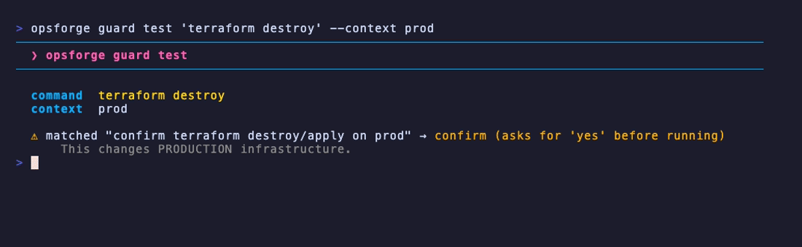
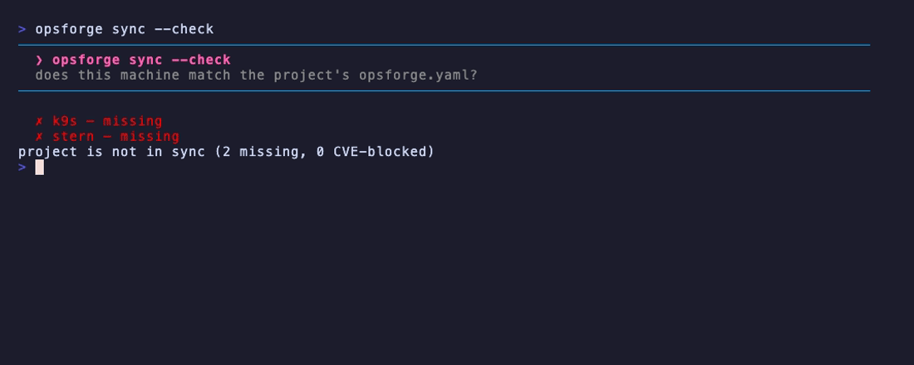
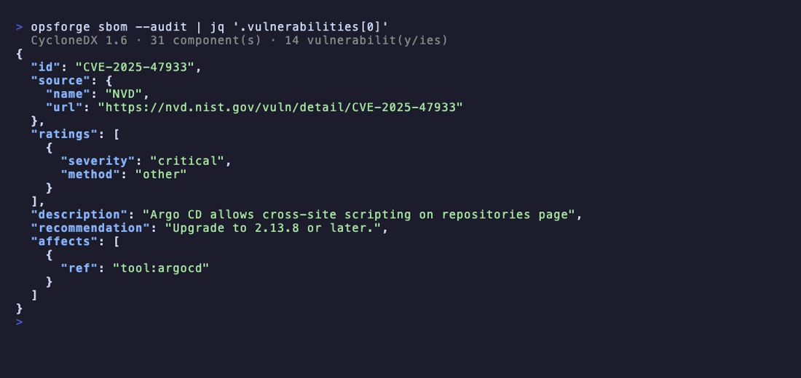

<div align="center">

# opsforge 🔥

**Une couche de sécurité pour votre poste de travail DevOps, pour qu'une commande étourdie (ou un agent IA) ne puisse pas rayer le mauvais cluster de la carte.**

Vous connaissez la situation : vous vouliez lancer ce `kubectl delete` sur
staging, mais votre shell pointait vers la prod. opsforge est la ceinture de
sécurité de ce moment-là. Il transforme votre shell (zsh, fish ou bash) en un
shell qui sait sur quel cluster vous êtes, et arrête une commande destructrice
avant qu'elle ne tombe, à partir de règles que *vous* avez écrites, dans un
fichier. Les mêmes règles s'appliquent, que ce soit vous au clavier ou [un agent
IA](#agents-ia-mcp) qui travaille sur votre machine.

C'est le cœur de l'affaire. Autour, opsforge garde aussi la machine honnête : il
audite [les credentials](#hygiène-des-credentials-verify) posés sur votre disque
et les [trous connus](#sbom--chaîne-dapprovisionnement) dans vos outils. Et
comme rien de tout ça n'aide sur une machine vide, il installe et maintient
aussi votre boîte à outils DevOps. Le tout dans un seul binaire. C'est un outil
perso, pas une plateforme d'équipe : pas de serveur, pas de compte, rien qui
vous enferme.

[English](README.md) · **Français**

[](https://github.com/Mrg77/opsforge/actions/workflows/ci.yml)
[](https://github.com/Mrg77/opsforge/releases/latest)
[](https://goreportcard.com/report/github.com/Mrg77/opsforge)
[](LICENSE)
<br>
[](#le-catalogue)
[](#sbom--chaîne-dapprovisionnement)
[](https://go.dev)


**[Essayer](#essayer-dans-une-sandbox) · [Installation](#installation) · [Aperçu](#aperçu-rapide) · [Workflows](#workflows-courants) · [Shell](#lenvironnement-shell-devops) · [Guards](#guards-policy-as-code) · [Mode projet](#mode-projet) · [SBOM & VEX](#sbom--chaîne-dapprovisionnement) · [Verify](#hygiène-des-credentials-verify) · [Agents IA (MCP)](#agents-ia-mcp) · [CI](#ci--intégrations) · [Catalogue](#le-catalogue) · [Sous le capot](#points-forts-dingénierie)**

</div>

---

## Ce que c'est

Voyez opsforge comme trois outils qui se trouvent partager un seul binaire. Les
voici, le plus intéressant en premier :

| | | |
|:--:|---|---|
| 🛡️ | **Les guards — le vrai sujet** | Une seule commande transforme votre shell (zsh, fish ou bash) en un shell qui *sait où il se trouve*. Quand vous tapez `kubectl delete` ou `terraform destroy` sur un cluster de production, il vous arrête et demande d'abord. Les règles sont les vôtres, écrites dans un fichier, et elles vous protègent au clavier *et* [tout agent IA](#agents-ia-mcp) qui travaille sur votre machine. Tout ce qui déclenche un guard sur prod est [consigné](#un-journal-daudit--quai-je-lancé-sur-prod-cette-semaine-), pour que vous puissiez y revenir plus tard. |
| 🔐 | **Garder la machine honnête** | Deux questions, deux réponses. *Les credentials sur ma machine sont-ils un risque ?* — [`opsforge verify`](#hygiène-des-credentials-verify) trouve les clés qui n'expirent jamais, les secrets en clair, les fichiers lisibles par tout le monde. *Mes outils ont-ils des trous connus ?* — [`opsforge audit`](#ci--intégrations) et compagnie produisent un inventaire signé ([SBOM](#sbom--chaîne-dapprovisionnement) + [VEX](#sbom--chaîne-dapprovisionnement)) de chaque CVE, et pointent celles que les attaquants exploitent *vraiment*. Tout en lecture seule, sans cloud. |
| 📦 | **Monter la boîte à outils** | Et parce qu'une couche de sécurité ne sert à rien sur une machine vide, opsforge installe aussi vos outils DevOps et les garde à jour : un sélecteur cherchable parmi **288 CLI triés sur le volet**, dans un seul binaire, sur macOS ou une machine Linux nue. Plus des [setups reproductibles](#mode-projet) : décrivez une machine (ou la boîte à outils d'un dépôt) dans un fichier et reconstruisez-la n'importe où. |

### Pourquoi ça existe

Une machine DevOps a un problème de sécurité que l'outillage habituel se contente
d'ignorer.

- **Un `kubectl delete` étourdi sur le mauvais cluster** n'a aucune ceinture de
  sécurité. L'outil l'exécute que vous soyez sur staging ou sur prod : il ne fait
  pas la différence, et il ne demandera rien. Pire : un **agent IA** peut
  maintenant le lancer *à votre place*, plus vite, sans que personne ne regarde.
- **Personne ne sait vraiment ce qui est risqué sur la machine.** Quels
  credentials n'expirent jamais ? Lesquels sont en clair ? Quel outil porte un
  trou que quelqu'un est en train d'exploiter là, maintenant ? Il faudrait
  vérifier à la main, outil par outil.
- **Reconstruire un poste, c'est une journée perdue.** Installer une vingtaine
  de CLI, puis brancher complétions, alias et un prompt correct pour chacun. À
  chaque fois.

opsforge réunit tout ça dans un seul binaire parce que ces problèmes partagent le
même lieu (votre shell) et la même donnée (les outils qu'il détecte). C'est
délibérément un **outil perso, pas une plateforme d'équipe** (pas de serveur, pas
de compte, rien qui vous enferme), pour que ça reste quelque chose que vous
*lancez*, pas quelque chose que vous devez *opérer*. (Vous vous interrogez sur une
flotte entière ? Voir [Les guards à l'échelle d'une
équipe](#les-guards-à-léchelle-dune-équipe).)

---

## Essayer dans une sandbox

Envie de voir les guards se déclencher sans rien installer ni toucher à de la
vraie infra ? Lancez l'image de démo jetable — un shell zsh déjà forgé, placé
dans un **faux contexte de prod**, avec des stubs no-op `kubectl`/`terraform`/`helm` :

```sh
docker run --rm -it ghcr.io/mrg77/opsforge-demo
```

Elle ouvre un court tour guidé — status → **guards** → le **journal d'audit** des
guards → l'hygiène des credentials **`verify`** → SBOM — puis vous rend la main
dans le shell : tapez vous-même `kubectl delete namespace payments` et regardez
le guard prod l'intercepter. Rien ne peut atteindre un vrai cluster : le contexte
« prod » est un faux kubeconfig d'une ligne, lu passivement, les outils sont des
stubs, et les credentials que `verify` signale sont **factices**, semés dans
l'image (une clé AWS, une clé SSH sans passphrase, un login docker en base64) —
vous voyez donc toute la couche de sécurité sans aucun vrai secret en jeu.

Vous préférez le navigateur ? Ouvrez-la dans un Codespace — même image, zéro
installation locale :

[](https://codespaces.new/Mrg77/opsforge?quickstart=1)

---

## Installation

```sh
brew install mrg77/tap/opsforge                                          # macOS / Linux
# ou le script d'installation :
curl -fsSL https://raw.githubusercontent.com/Mrg77/opsforge/main/install.sh | sh
```

Le script télécharge le bon binaire pour votre OS/arch dans `~/.local/bin` (à
surcharger avec `OPSFORGE_INSTALL_DIR`, à épingler avec `OPSFORGE_VERSION=v1.2.3`).
Depuis les sources : `go install github.com/Mrg77/opsforge@latest`.

Pour rester à jour, `opsforge self update` télécharge la dernière release,
**vérifie son SHA-256 publié avant de remplacer le binaire en place**, et ne fait
rien si vous êtes déjà à jour (`--check` pour cron/CI).

> **Windows :** passez par WSL — l'installation s'appuie sur Homebrew et la couche
> shell vise zsh, fish et bash. Le support natif winget/scoop + PowerShell est prévu.

---

## Aperçu rapide

```sh
opsforge              # sélecteur interactif (onglets : 1 Outils · 2 Mises à jour · 3 Sécurité)
opsforge status       # cockpit de votre poste de travail en un coup d'œil
opsforge doctor       # bilan de santé complet — CVE & secrets exposés inclus
opsforge audit        # scan des CVE des outils installés (--secrets : creds exposés aussi)
opsforge guard test "terraform destroy" --context prod   # simule une règle de guard
opsforge apply --check my-setup.yaml                     # vérifie que cette machine correspond à votre snapshot (CI)
opsforge self update  # mise à jour, checksum vérifié avant le remplacement
```

<table>
<tr><th align="left">Commande</th><th align="left">Ce qu'elle fait</th></tr>
<tr><td><code>opsforge</code></td><td>Sélecteur interactif — parcourir, vérifier, installer</td></tr>
<tr><td><code>opsforge status</code></td><td>Cockpit : outils, mises à jour, shell, thème, et un <strong>score de posture de sécurité 0–100</strong> en un coup d'œil</td></tr>
<tr><td><code>opsforge notify [--json]</code></td><td>Un seul digest de ce qui réclame votre attention — CVE, mises à jour, secrets exposés, un opsforge plus récent (voir <a href="#le-digest-notify">notify</a>)</td></tr>
<tr><td><code>opsforge install kubectl helm</code></td><td>Installation non interactive par nom (scriptable)</td></tr>
<tr><td><code>opsforge install --profile aws-k8s</code></td><td>Installe toute une stack prédéfinie en une commande</td></tr>
<tr><td><code>opsforge upgrade [-u] [outil…]</code></td><td>Met tout à jour, seulement l'obsolète (<code>-u</code>), ou les outils nommés</td></tr>
<tr><td><code>opsforge audit [--secrets] [--json]</code></td><td>Scan CVE des outils installés · scan de secrets exposés en option · <code>--json</code> + code de sortie non nul pour verrouiller la CI</td></tr>
<tr><td><code>opsforge verify [--strict] [--json]</code></td><td>Audit d'hygiène des credentials du poste — clés statiques, secrets en clair, permissions trop larges, certs qui expirent · lecture seule, hors-ligne (voir <a href="#hygiène-des-credentials-verify">verify</a>)</td></tr>
<tr><td><code>opsforge guard [init|list|test|lint|log]</code></td><td>Guards policy-as-code sur les commandes destructrices · <code>lint</code>/<code>test --json</code> les rendent vérifiables en CI (voir <a href="#guards-policy-as-code">Guards</a>)</td></tr>
<tr><td><code>opsforge env [unlock|set|list|rm|load|lock]</code></td><td>Coffre de variables d'env chiffré (age) — persiste les secrets sans clair ; <code>unlock</code> une fois (session type ssh-agent), puis <code>opsenv</code> les charge dans votre shell (voir <a href="#coffre-denvironnement-chiffré">coffre env</a>)</td></tr>
<tr><td><code>opsforge use terraform@1.5</code></td><td>Épingle une version d'outil ici (délègue à mise/asdf)</td></tr>
<tr><td><code>opsforge sync [--check] [--init]</code></td><td>Installe les outils déclarés par un <code>opsforge.yaml</code> committé · <code>--check</code> signale la dérive pour la CI · gate CVE en option (voir <a href="#mode-projet">Mode projet</a>)</td></tr>
<tr><td><code>opsforge sbom [--audit] [--sign]</code></td><td>Émet un SBOM CycloneDX 1.6 des outils installés · <code>--audit</code> y embarque leurs CVE · <code>--sign</code> ajoute un bundle Sigstore (voir <a href="#sbom--chaîne-dapprovisionnement">SBOM</a>)</td></tr>
<tr><td><code>opsforge vex [--kev] [--sign]</code></td><td>Émet un document OpenVEX des CVE de vos outils · <code>--kev</code> signale celles activement exploitées (CISA KEV) · <code>--sign</code> le signe (voir <a href="#vex--cisa-kev">VEX</a>)</td></tr>
<tr><td><code>opsforge scan &lt;image&gt; [--diff]</code></td><td>Scanne une image de conteneur (via syft/trivy + le moteur OSV d'opsforge) · <code>--diff</code> la corrèle avec votre poste (voir <a href="#scanner-une-image-de-conteneur">scan</a>)</td></tr>
<tr><td><code>opsforge mcp</code></td><td>Lance un serveur MCP en lecture seule pour qu'un agent IA interroge votre poste de travail (voir <a href="#agents-ia-mcp">MCP</a>)</td></tr>
<tr><td><code>opsforge snapshot</code> / <code>apply</code></td><td>Exporter / reconstruire tout un poste de travail</td></tr>
<tr><td><code>opsforge apply --check &lt;fichier-ou-url&gt;</code></td><td>Vérifie une machine par rapport à votre snapshot sans la modifier · code de sortie non nul en cas d'écart (<code>--json</code>)</td></tr>
<tr><td><code>opsforge version</code></td><td>Affiche la version, le commit et les infos de build (aussi <code>--version</code> ; <code>--json</code> pour scripter)</td></tr>
<tr><td><code>opsforge self [version|update]</code></td><td>Affiche la version ou se met à jour — checksum vérifié avant le remplacement (<code>--check</code> pour CI/cron)</td></tr>
<tr><td><code>opsforge history [famille|outil]</code></td><td>Commandes shell récentes, regroupées par famille d'outils (<code>kube</code>, <code>git</code>, <code>tf</code>… — voir <a href="#history">History</a>)</td></tr>
<tr><td><code>opsforge ai</code></td><td>Montre quel backend IA opsforge utilise (un CLI IA que vous avez déjà — aucune clé à gérer), ou comment en configurer un</td></tr>
<tr><td><code>opsforge explain [--last] &lt;cmd&gt;</code></td><td>Demande à votre IA d'expliquer une commande ou votre dernière erreur (le raccourci <code>??</code> du shell)</td></tr>
<tr><td><code>opsforge advise</code></td><td>Plan de remédiation priorisé par l'IA depuis vos vrais findings — quoi corriger d'abord (CVEs, mises à jour, secrets fuités) et la commande exacte</td></tr>
<tr><td><code>opsforge list [all] [-u]</code></td><td>Outils installés · catalogue complet · seulement les mises à jour (<code>--json</code> pour scripter)</td></tr>
<tr><td><code>opsforge list &lt;terme&gt;</code></td><td>Cherche dans tout le catalogue par nom, description ou catégorie (ex. <code>list dns</code>)</td></tr>
<tr><td><code>opsforge profiles</code></td><td>Profils de stack avec leur statut d'installation</td></tr>
<tr><td><code>opsforge theme [set &lt;nom&gt;]</code></td><td>Lister, prévisualiser ou fixer les thèmes de couleurs</td></tr>
<tr><td><code>opsforge doctor</code></td><td>Bilan de santé complet — système, shell, boîte à outils, <strong>CVE &amp; secrets exposés</strong> (<code>--json</code>)</td></tr>
</table>

> **Lisible par une machine, partout.** Un flag global `--json` fait sortir à
> `list`, `status`, `doctor` et `audit` du JSON structuré au lieu de la TUI, si
> bien que les mêmes commandes alimentent un script tout aussi volontiers. Voir
> [CI & intégrations](#ci--intégrations).

### Le sélecteur

Lancez le binaire seul pour parcourir le catalogue par catégorie et installer ce
que vous cochez.

- **Onglets (façon k9s) :** `1` Outils · `2` Mises à jour (uniquement l'obsolète) ·
  `3` Sécurité (scan CVE en direct des outils installés)
- **Touches :** `space` cocher/décocher · `u` toutes les mises à jour · `a` tout ce
  qui n'est pas installé · `s` enregistrer la sélection comme profil · `/` filtrer ·
  `i` installer · `q` quitter
- **Marqueurs :** `[✓]` vert : installé · `[✓]` orange : mise à jour disponible ·
  `[▸]` cyan : sélectionné · `[ ]` gris : non installé

---

## Workflows courants

Trois parcours qui montrent comment les pièces s'emboîtent.

### Mettre en route une nouvelle machine

Vous changez de laptop ? Reconstruisez votre poste complet à partir d'un seul
fichier, au lieu d'une journée de config manuelle.

```sh
opsforge snapshot -o my-setup.yaml         # sur votre machine actuelle : outils + shell + thème + guards → un YAML
opsforge apply https://…/my-setup.yaml     # sur la nouvelle : passez le plan en revue, puis reconstruisez tout
opsforge shell install && exec zsh         # activez le shell DevOps
```

### Faire de votre CI une barrière contre les CVE & les secrets

Le binaire que vous utilisez en interactif devient une barrière de sécurité en une
seule ligne.

```sh
opsforge audit --json | tee cve-report.json   # code de sortie non nul sur toute CVE HIGH/CRITICAL — fait échouer le job à lui seul
opsforge audit --secrets --json               # échoue aussi sur un identifiant exposé
```

Workflow prêt à l'emploi : [`examples/ci-security-gate.yml`](examples/ci-security-gate.yml).

### Versionner & valider votre politique de guards prod

Versionnez vos propres règles de sûreté prod dans un seul fichier et faites-les
respecter en CI — comme vous versionneriez le reste de vos dotfiles.

```sh
opsforge guard init                                            # génère un guards.yaml de départ, puis committez-le
opsforge guard lint                                            # le valide — code de sortie non nul sur une règle invalide
opsforge guard test "terraform destroy" --context prod --json  # vérifiez en CI que les destroy en prod sont bien refusés
```

---

## Au-delà des bases

### Profils de stack

Un profil, c'est juste un paquet d'outils avec un nom. Installez toute une stack
en une commande, ou créez le vôtre :

```sh
opsforge install --profile aws-k8s   # aws, eksctl, kubectl, helm, k9s, terraform…
opsforge profiles                    # liste tout avec le statut d'installation
```

Les profils intégrés sont `core`, `k8s`, `aws-k8s`, `gcp-k8s`, `iac`,
`observability`, `security`, `sysadmin`, `netsec`, `secrets` et `ai`. Vous voulez
le vôtre ? Dans le sélecteur, cochez vos outils et appuyez sur `s` pour
enregistrer un profil personnel dans `~/.config/opsforge/profiles.yaml`. À partir
de là, `opsforge install --profile my-stack` le reproduit n'importe où.

### Poste de travail as-code

La config de votre machine ne devrait pas être un montage artisanal, différent sur
chaque poste et refait à la main :

```sh
opsforge snapshot -o my-setup.yaml    # outils + profils + shell + thème + guards + gestionnaire de versions → un fichier
opsforge apply <fichier-ou-url>       # le reconstruit sur n'importe quelle machine
opsforge apply --check <fichier-ou-url>  # compare une machine à ce fichier, sans rien changer
```

Un snapshot capture **tout** le poste de travail géré — outils installés, profils
personnalisés, état de l'environnement shell, **thème** actif, **politique de
guards** (le `guards.yaml` brut) et **gestionnaire de versions** détecté. `apply`
affiche le plan complet et demande confirmation avant de toucher à quoi que ce
soit (`--yes` pour les scripts) ; il restaure le thème et les règles de guards en
même temps que les outils.

**Comparer une machine à un snapshot de référence.** `apply --check` compare cette
machine à un snapshot **que vous avez figé plus tôt**, **sans rien modifier**, et
sort avec un **code non nul dès qu'il y a un écart** — un outil manquant, ou un
thème / des guards / un shell / un gestionnaire de versions qui diffère. Avec
`--json`, il produit un rapport structuré — `{compliant, missing_tools, drift}` —
pour qu'un job CI puisse vérifier que votre laptop, ou une image de build,
correspond toujours à votre config de référence :

```sh
opsforge apply --check my-setup.yaml            # fait échouer le job au moindre écart
opsforge apply --check my-setup.yaml --json | jq '.compliant'
```

Les snapshots sont **compatibles vers l'avant** : le format est passé de la v1
(outils, profils, shell) à la v2 (qui ajoute thème, guards, gestionnaire de
versions), et les anciens fichiers v1 se chargent toujours — les nouveaux champs
restent simplement vides.

### Audit de sécurité

```sh
opsforge audit             # CVE dans vos outils installés
opsforge audit --secrets   # + identifiants exposés dans l'historique / rc / .env
```

Croise les versions installées avec [OSV.dev](https://osv.dev), triées par
sévérité, avec la version corrigée :

```
⚠ argocd         2.11.0
    [CRITICAL] CVE-2025-47933 Argo CD allows cross-site scripting…  → fixed in 2.13.8
    [HIGH]     CVE-2025-59531 Unauthenticated argocd-server panic…  → fixed in 2.14.20
✓ helm           4.2.3 — no known vulnerabilities
```

Le matching se fait côté client contre les plages affectées d'OSV : une CVE
corrigée avant votre version (ou seulement dans un futur majeur) n'est donc pas
signalée. `--secrets` passe au crible l'historique du shell, les fichiers rc et
les `.env` locaux pour y débusquer des tokens AWS/GitHub/GitLab/Slack, des clés
privées, des `--from-literal`, `docker login -p`… en masquant toujours les
valeurs.

### Épingler des versions d'outils

```sh
opsforge install mise
opsforge use terraform@1.5   # l'épingle dans ce répertoire
```

Délègue à **mise** (préféré) ou **asdf** — inutile de réinventer un gestionnaire
de versions.

---

## L'environnement shell DevOps

```sh
opsforge shell install && exec zsh    # zsh
opsforge shell install && exec fish   # fish (auto-détecté depuis $SHELL)
opsforge shell install && exec bash   # bash
```

Ceci prend votre **propre zsh, fish ou bash** et le rend conscient du DevOps. Il
ne remplace pas votre shell, il améliore celui que vous utilisez déjà. (`shell
install` détecte votre shell depuis `$SHELL`, ou forcez-le avec `--shell
zsh|fish|bash` ; `shell uninstall` remet tout comme avant.)

> **zsh · fish · bash.** Le prompt qui signale la prod, l'aide inline `?` et les
> alias DevOps marchent dans les trois. Deux réserves à énoncer clairement :
> - Les agréments interactifs ci-dessous (suggestion en ligne, coloration
>   syntaxique, recherche d'historique par préfixe) sont **natifs dans fish**,
>   opsforge n'y ajoute donc que les guards et le prompt. Sur **zsh** il installe
>   les plugins qui les fournissent. **bash** n'a pas d'équivalent standard, il
>   se rabat sur readline tel quel.
> - Le **guard bloquant** est pleinement fiable sur **zsh et fish** (les deux
>   peuvent annuler une commande avant qu'elle s'exécute). **bash ne peut pas**
>   le faire proprement : son guard est donc *best-effort*. Il confirme et
>   avertit, mais le passage en arrière-plan et certaines constructions
>   multi-lignes se comportent différemment. Pour un blocage garanti, utilisez zsh
>   ou fish. (Les guards sont un filet de sécurité, pas une barrière de sécurité,
>   quel que soit le shell.)
>
> La description ci-dessous détaille l'expérience zsh.

Les détails, maintenant. opsforge transforme votre **propre zsh** en un
environnement conscient du DevOps (ses modules vivent sous
`~/.config/opsforge/shell/`, et `shell uninstall` restaure tout) :

- **Une édition qui reste discrète, à la demande.** Rien ne surgit pendant que
  vous tapez : juste une suggestion grise en ligne, issue de votre historique.
  `↑`/`↓` parcourent l'historique en filtrant sur le **début de ligne entier** que
  vous avez tapé, `→` accepte toute la suggestion, `Tab` l'accepte mot à mot, et la
  ligne se colore au fil de la frappe.
- **Complétion pour les outils qui n'en ont pas.** Les outils avec un completer
  zsh natif (kubectl, helm, gh, docker, git…) gardent le leur. Pour ceux qui n'en
  ont pas — **terraform, tofu, terragrunt, packer** — opsforge complète les
  sous-commandes **dynamiquement en parsant le `--help` de l'outil**, à tous les
  niveaux : `terraform state <Tab>` propose `list`/`show`/`mv`/`rm`/`pull`/`push`…
  Même source de vérité que l'aide inline `?` (l'outil lui-même), donc toujours à
  jour — aucune liste de sous-commandes à maintenir. Les résultats sont mis en
  cache par chemin de commande ; désactivez avec `OPSFORGE_HELPCOMP=0`.

  <table>
  <tr><th align="left">Touche</th><th align="left">Ce qu'elle fait</th></tr>
  <tr><td><code>↑</code> / <code>↓</code></td><td>Parcourt l'historique en filtrant sur le début de ligne tapé (<code>kubectl get pods -n s</code> + <code>↑</code> ne fait défiler que les lignes qui commencent ainsi)</td></tr>
  <tr><td><code>→</code></td><td>Accepte toute la suggestion grise</td></tr>
  <tr><td><code>Tab</code></td><td>Accepte la suggestion grise mot à mot (<code>ansible-play</code> + <code>Tab</code> → <code>ansible-playbook </code>)</td></tr>
  <tr><td><code>Ctrl-Space</code></td><td>Complétion fichier / commande</td></tr>
  <tr><td><code>Ctrl-R</code></td><td>Recherche dans tout votre historique</td></tr>
  </table>

  Vous préférez l'ancien menu toujours ouvert (zsh-autocomplete) ? Mettez
  `OPSFORGE_AUTOMENU=1`. Pour désactiver toute la couche, `OPSFORGE_INTERACTIVE=0`.
- **`export <Tab>` connaît l'écosystème.** Le zsh natif ne complète que les
  variables *déjà présentes* dans votre session — donc une variable jamais
  définie (ex. `AWS_SECRET_ACCESS_KEY`) n'est jamais proposée, vous la retapez
  en entier. opsforge apprend à `export`/`typeset` les **variables standard des
  outils qu'il gère** (AWS, GCP, Azure, Kubernetes, Terraform, Vault, Docker,
  GitHub…), chacune avec une description. `export AWS_<Tab>` liste
  `AWS_ACCESS_KEY_ID`, `AWS_SECRET_ACCESS_KEY`, `AWS_REGION`, `AWS_PROFILE`… Pour
  les variables sûres et énumérables, il complète aussi la **valeur** —
  `AWS_PROFILE=<Tab>` lit votre `~/.aws/config`, `AWS_REGION=<Tab>` liste les
  régions, `TF_LOG=<Tab>` propose les niveaux de log. Il ne complète **jamais**
  la valeur d'un secret (clés, tokens, mots de passe) : il n'y a rien de sûr à
  suggérer et il ne lit aucun secret sur le disque. Désactivez avec
  `OPSFORGE_ENVCOMP=0`.
- **Aide `?`.** Appuyez sur `?` sur une ligne vide pour une antisèche aux couleurs
  du thème. Tapez `kubectl get ?` et vous obtenez l'aide de cette commande, rendue
  sous un en-tête encadré avec la syntaxe man colorée par `bat`. Tapez `??` pour
  qu'une IA vous explique votre dernière erreur.
- **Un prompt qui sait où il est.** Le prompt de droite affiche le
  `cluster:namespace` kube et vire au **rouge dès que le contexte ressemble à de la
  prod**. C'est une alarme *visuelle* passive, que vous voyez **avant même de
  commencer à taper**, à côté du compte cloud et du workspace terraform (affichés
  chacun seulement quand c'est pertinent). Et à gauche, un prompt épuré : répertoire
  relatif au dépôt, branche git avec ses marqueurs dirty/ahead/behind, durée de la
  dernière commande, et un `❯` qui rougit en cas d'échec. Tout est lu en local.
  Jamais un cloud ni un cluster n'est contacté. Vous préférez **starship** ?
  Installez-le (`opsforge install starship`) et opsforge l'initialise pour vous
  puis s'efface — aucune édition de `~/.zshrc`, pas de double prompt
  (`OPSFORGE_STARSHIP=0` garde le prompt opsforge à la place).
- **Guards policy-as-code.** Avant une commande destructrice (`kubectl delete`,
  `terraform destroy`, `helm uninstall`…) dans un contexte de production, opsforge
  peut confirmer, avertir ou bloquer. Le tout piloté par des [règles que vous
  écrivez dans un fichier](#guards-policy-as-code), et non par des vérifications
  codées en dur dans l'outil. `OPSFORGE_GUARDS=0` pour désactiver.
- **Alias & raccourcis.** `k`, `tf`, `dc`, plus `kx`/`kn` pour changer de
  contexte/namespace kube (sélecteur fzf quand il est là). Le builtin `history`
  est élargi pour afficher les **200** dernières lignes (`history 1` pour tout), et
  `hg <terme>` grep l'intégralité de votre historique, tandis que
  [`opsforge history`](#history) le regroupe par famille d'outils DevOps.
- **Un signalement proactif.** Une fois par session, opsforge affiche une ligne
  compacte dans votre propre shell quand quelque chose réclame votre attention :
  une CVE vient de toucher un outil installé, des mises à jour attendent, un secret
  fuit, ou un opsforge plus récent est sorti. Il s'appuie sur un cache local
  (`~/.cache/opsforge/`, TTL 6h) et rafraîchit un cache périmé en arrière-plan,
  pour que le prompt ne bloque jamais sur le réseau. Lancez
  [`opsforge notify`](#le-digest-notify) pour le détail complet, ou coupez ce
  signalement avec `OPSFORGE_NOTIFY=0`.
- **Intégrations.** `fzf`, `zoxide`, `atuin` et `starship` sont branchés
  automatiquement quand ils sont présents.

**Trois couches, trois rôles :** le **prompt** est une alarme *passive* — il
rougit pour que vous **voyiez** que vous êtes en prod ; les
[**guards**](#guards-policy-as-code) sont une barrière *active* — ils
**arrêtent** une commande destructrice ; le
[signalement **notify**](#le-digest-notify) est une veille *proactive* — il vous
**prévient** quand une CVE, une mise à jour ou une fuite tombe sur votre machine.

Chaque module est validé au `zsh -n` en CI : un script cassé ne peut donc jamais
arriver jusqu'à votre shell.

<table>
<tr><th align="left">Commande shell</th><th align="left">Ce qu'elle fait</th></tr>
<tr><td><code>opsforge shell install</code></td><td>Installe l'environnement zsh dans <code>~/.zshrc</code> (idempotent)</td></tr>
<tr><td><code>opsforge shell uninstall</code></td><td>Le retire proprement (restaure <code>~/.zshrc</code>)</td></tr>
<tr><td><code>opsforge shell doctor</code></td><td>Montre ce qui est fourni et dans quel état</td></tr>
<tr><td><code>opsforge shell sync</code></td><td>Rafraîchit les modules shell <em>et</em> les complétions en cache (à lancer après avoir mis opsforge à jour)</td></tr>
</table>

### History

Votre historique shell regorge des commandes exactes dont vous aurez à nouveau
besoin — noyées sous tout le reste. `opsforge history` en isole une seule famille
d'outils DevOps, pour que vous retrouviez le `kubectl port-forward` de la semaine
dernière sans faire défiler des pages.

```sh
opsforge history              # vue d'ensemble : chaque famille, avec son nombre de commandes récentes
opsforge history kube         # commandes kubectl / helm / k9s / argocd… récentes
opsforge history tf           # terraform / tofu / terragrunt
opsforge history git -n 50    # plus de résultats (0 = sans limite)
opsforge history kube --json  # lisible par une machine
```

Les familles intégrées regroupent les outils que vous associez naturellement — et
reprennent volontairement les domaines utilisés par les [guards](#guards-policy-as-code)
et les profils, pour que `kube`, `tf`, `cloud`… veuillent dire la même chose
partout dans le produit :

<table>
<tr><th align="left">Famille</th><th align="left">Outils</th></tr>
<tr><td><code>kube</code></td><td>kubectl, helm, k9s, kubectx, kustomize, stern, kubeseal, flux, argocd…</td></tr>
<tr><td><code>git</code></td><td>git, gh, glab, lazygit, tig</td></tr>
<tr><td><code>tf</code></td><td>terraform, tofu, terragrunt, tflint, terraform-docs</td></tr>
<tr><td><code>docker</code></td><td>docker, docker-compose, podman, nerdctl, colima</td></tr>
<tr><td><code>cloud</code></td><td>aws, gcloud, az, doctl, eksctl, flyctl, vercel</td></tr>
<tr><td><code>ansible</code></td><td>ansible, ansible-playbook, ansible-galaxy, ansible-vault</td></tr>
</table>

Passez un nom de famille, ou n'importe quel exécutable pour filtrer sur ce seul
outil. Les résultats sont des commandes distinctes, les plus récentes en tête,
avec un compteur d'exécutions `×N` ; `--limit/-n` les plafonne (20 par défaut,
`0` = tout) et `--json` les sort pour les scripts. L'historique est analysé
**passivement** — opsforge lit le fichier, il n'exécute jamais rien.

---

## Coffre d'environnement chiffré

Ré-exporter les mêmes `AWS_SECRET_ACCESS_KEY`, `VAULT_TOKEN` ou identifiants de
registre dans chaque nouveau terminal, c'est pénible — mais les mettre dans
`~/.zshrc` les persiste *en clair*, précisément la fuite que `opsforge audit
--secrets` (et n'importe quel backup de dotfiles) va trouver. `opsforge env`
est la voie du milieu : un coffre verrouillé par passphrase qui persiste vos
variables **sans jamais écrire un secret en clair sur le disque**.

```sh
opsforge env unlock                      # tapez la passphrase UNE fois (session ~15 min)
opsforge env set AWS_SECRET_ACCESS_KEY   # valeur lue masquée — pas de passphrase (session ouverte)
opsforge env set AWS_DEFAULT_REGION=us-east-1   # non-secret ? passez-la en ligne
opsforge env list                        # les NOMS de variables seulement — jamais les valeurs
opsenv                                    # charge dans CE shell (pas de passphrase — session ouverte)
opsforge env lock                        # oublie la session maintenant (ou laissez-la expirer)
```

**Déverrouillez une fois, puis travaillez — comme ssh-agent.** Le coffre est
chiffré par une clé aléatoire, et cette clé est elle-même chiffrée par votre
passphrase. `unlock` déchiffre la clé une fois et la met en cache dans un
**fichier RAM 0600 qui expire tout seul** (~15 min) ; ensuite chaque
`set`/`list`/`load`/`opsenv` la réutilise **sans redemander**. Vous tapez la
passphrase une fois, pas à chaque commande.

<table>
<tr><th align="left">Garantie</th><th align="left">Comment</th></tr>
<tr><td>Une passphrase, pas par commande</td><td>Modèle ssh-agent : <code>unlock</code> met la clé du coffre en cache dans une session RAM ($XDG_RUNTIME_DIR / $TMPDIR, 0600, TTL ~15 min). Ce qui est en cache, c'est la <em>clé</em>, jamais la passphrase, et ça expire tout seul.</td></tr>
<tr><td>Rien en clair au repos</td><td><code>~/.config/opsforge/env.age</code> (les variables) et <code>identity.age</code> (la clé, enveloppée par votre passphrase) sont chiffrés avec <a href="https://age-encryption.org">age</a>. Un <code>cat</code> ne révèle rien ; <code>audit --secrets</code> les ignore.</td></tr>
<tr><td>Les secrets ne passent jamais par argv/historique</td><td><code>env set NAME</code> lit la valeur <em>masquée</em> depuis le terminal — jamais en argument de commande.</td></tr>
<tr><td>Chargé dans votre vrai shell</td><td><code>opsenv</code> est une fonction shell (installée par la couche) qui <code>eval</code> les exports déchiffrés dans la session courante — les prompts partent sur stderr, ils ne peuvent pas polluer le texte eval'é.</td></tr>
</table>

**Honnêteté sur le modèle de menace :** une fois chargées dans un shell, les
valeurs sont des variables d'environnement ordinaires, visibles par les
sous-process ; et pendant le déverrouillage, la clé du coffre vit dans un
fichier RAM 0600 lisible par vous. C'est inhérent au confort. Ce que le coffre
apporte : rien en clair sur le disque, plus de retape, une clé qui expire toute
seule, et des dotfiles sauvegardables sans fuite. La crypto, c'est
[age](https://age-encryption.org) via sa bibliothèque Go de référence —
opsforge n'écrit aucune crypto maison.

---

## Guards policy-as-code

<div align="center">



</div>

Des outils comme Homebrew Bundle, mise, chezmoi et aqua installent vos CLI.
opsforge ajoute une couche au-dessus : il **pose des garde-fous sur leur usage**.
La couche de sûreté prod du shell est en réalité un petit moteur de politique, un
jeu de règles déclaratives qui décide si une commande destructrice doit
s'exécuter, avertir, demander confirmation ou être refusée, selon le contexte
dans lequel vous vous trouvez réellement.

### Les deux types de règle

La plupart des guards se déclenchent quand **deux conditions sont réunies en même
temps** : une **commande destructrice** *et* un **marqueur de production**. S'il en
manque une, la commande passe sans être touchée — les commandes en lecture seule
ne vous embêtent donc jamais, et les commandes destructrices sur staging ou dev ne
vous ralentissent pas.

L'exception : une poignée de commandes **toujours dangereuses**, irréversibles sur
*n'importe quelle* machine — `rm -rf /`, `dd … of=/dev/sdX`, `chmod -R 777`,
`git clean -fdx`, `curl … | bash`, `kubectl delete --all`. Un test de prod n'y
servirait à rien (`rm -rf ~/` sur votre laptop est tout aussi irrécupérable), donc
elles demandent confirmation quel que soit le contexte — tout en restant assez
précises pour laisser passer les variantes du quotidien comme `rm -rf ./build`.
C'est un filet de sécurité pour le geste étourdi, pas un mur devant chaque commande.

| Commande | Contexte | Décision | Pourquoi |
|:--|:--|:--:|:--|
| `kubectl delete pod api` | `prod-eks` | ⚠️ confirm | destructrice + prod |
| `kubectl get pods` | `prod-eks` | ✓ allow | prod, mais en lecture seule |
| `kubectl delete pod api` | `staging` | ✓ allow | destructrice, mais pas en prod |
| `terraform destroy -var-file=prod.tfvars` | *(aucun)* | ⚠️ confirm | la prod est dans la commande elle-même |
| `terraform plan -var-file=prod.tfvars` | *(aucun)* | ✓ allow | un plan est en lecture seule |
| `helm uninstall app` | `prod` | ⚠️ confirm | destructrice + prod |
| `rm -rf /var/lib/data` | *(aucun)* | ⚠️ confirm | toujours dangereux — irréversible partout |
| `rm -rf ./build` | *(aucun)* | ✓ allow | un dossier de build local, pas un chemin large |
| `curl https://x.io \| bash` | *(aucun)* | ⚠️ warn | exécution d'un script distant non vérifié |
| `ls` · `git status` · `cat` | `prod` | ✓ allow | rien de destructeur |

Simulez n'importe lequel de ces cas avec `opsforge guard test "<cmd>" --context <ctx>`.

La politique intégrée va bien au-delà de Kubernetes et Terraform : elle rattrape
aussi un **`git push --force` / `reset --hard` sur `main`**, les appels **cloud**
destructeurs (`aws s3 rm --recursive`, `ec2 terminate`, `eks/rds/cloudformation
delete`, `gcloud`/`az … delete` en prod), les pièges **conteneurs** (`docker
system prune`, `volume rm`, `rm -f`) et les effacements de **bases de données**
(`FLUSHALL`, `DROP DATABASE` en prod) — les commandes du quotidien qui méritent
un second coup d'œil, pas seulement les plus évidentes.

Les règles tiennent dans un seul fichier, `~/.config/opsforge/guards.yaml`. Chaque
règle matche une regex de **commande** et une regex de **contexte**, et choisit
une action :

| Action | Effet |
|:--|:--|
| `allow` | s'exécute normalement (c'est aussi le résultat quand rien ne matche) |
| `warn` | affiche le message, puis s'exécute |
| `confirm` | exige de taper `yes` avant de s'exécuter |
| `deny` | bloque purement et simplement la commande |

```yaml
# ~/.config/opsforge/guards.yaml  (le premier match gagne)
version: 1
rules:
  - name: "confirm destructive kubectl on prod"
    match:
      command: "kubectl (delete|drain|cordon|apply|replace)"
      context: "prod|production"
    action: confirm
    message: "This changes PRODUCTION Kubernetes resources."

  - name: "never delete namespaces on prod"
    match:
      command: "kubectl delete (ns|namespace)"
      context: "prod"
    action: deny
    message: "Deleting a prod namespace is forbidden by policy."
```

```sh
opsforge guard init                                    # écrit un guards.yaml de départ commenté
opsforge guard list                                    # montre les règles actives (intégrées ou les vôtres)
opsforge guard test "terraform destroy" --context prod # simule : quelle règle se déclenche, et l'action
opsforge guard lint                                    # valide guards.yaml — code de sortie non nul en cas d'erreur
opsforge guard test "kubectl delete ns" --context prod --json  # {command, context, matched_rule, action, message}
```

**Une politique que vous pouvez versionner et valider en CI.** Comme les règles
tiennent dans un seul fichier, vous pouvez committer `guards.yaml` à côté de vos
dotfiles et le faire respecter en CI :

- `opsforge guard lint` valide la politique active et **sort avec un code non nul**
  quand elle est cassée — une regex invalide, une action inconnue ou une mauvaise
  version fait échouer le job, au lieu de retomber en silence sur la politique par
  défaut à l'exécution.
- `opsforge guard test "<cmd>" --context prod --json` renvoie la décision sous la
  forme `{command, context, matched_rule, action, message}`, pour qu'un pipeline
  puisse **vérifier** que, mettons, `terraform destroy` est bien `deny`é en prod —
  c'est le même appel `Evaluate` que celui du shell, le test ne peut donc pas
  diverger du comportement réel.

Les guards s'appliquent sur votre propre shell, et la politique qui les pilote
est **testable et versionnable** comme le reste de votre config — au lieu d'être
bricolée à la main, différente sur chaque machine.

### Un journal d'audit : qu'ai-je lancé sur prod cette semaine ?

Chaque fois qu'un guard se déclenche — warn, confirm ou deny — opsforge le
consigne dans un journal local, append-only. `opsforge guard log` le rejoue, et
répond à la seule chose que votre historique shell ne peut pas dire : *qu'ai-je
lancé sur un contexte de production, et le guard l'a-t-il laissé passer ?*

```sh
opsforge guard log               # tout ce que le guard a signalé, du plus ancien
opsforge guard log --prod        # seulement les contextes production-like
opsforge guard log --since 7d    # la dernière semaine
opsforge guard log --action deny # seulement ce qui a été bloqué
opsforge guard log --json        # lisible par une machine
```

Votre historique dit *ce que* vous avez tapé ; ceci dit *ce qui était dangereux,
dans quel contexte, et comment ça a été traité* — avec l'horodatage. C'est stocké
uniquement dans `~/.local/state/opsforge/guard-audit.jsonl` (mode 0600), ne quitte
jamais votre machine, et ne consigne que les commandes guardées — pas tout votre
historique (c'est le rôle d'[`opsforge history`](#history)). Best-effort : un
accroc de journalisation ne bloque jamais le shell.

### Comment opsforge sait que vous êtes en prod

Le « contexte » sur lequel une règle matche provient de **deux sources**, et
opsforge assume ouvertement les compromis de chacune :

- **Lu passivement depuis votre environnement** — sans lancer une seule commande.
  opsforge récupère le `current-context` de la kubeconfig, `AWS_PROFILE`/`AWS_VAULT`
  (ou `CLOUDSDK_ACTIVE_CONFIG_NAME`) et le workspace terraform
  (`.terraform/environment`). Il **ne lance jamais `kubectl` ni `gcloud`** pour
  savoir où vous êtes : évaluer une règle ne peut donc pas déclencher un login OIDC
  dans le navigateur ni rester bloqué sur un CLI wrapper.
- **Lu depuis la commande elle-même** — parce qu'en 2026, les équipes ciblent bien
  plus souvent la prod avec `-var-file=prod.tfvars` ou un dossier
  `environments/prod/` qu'avec un *workspace* terraform. La politique par défaut
  matche donc aussi ces marqueurs **dans la ligne de commande** pour
  `terraform`/`tofu`/`terragrunt` : `terraform destroy -var-file=prod.tfvars`
  demande confirmation même sans workspace défini. `terraform plan …` reste
  autorisé — c'est en lecture seule.

> **Voyez clairement ce que c'est.** Les guards sont un **filet de sécurité contre
> le geste étourdi** — ils vous rattrapent quand vous changez d'env sans le
> remarquer, pas face à une erreur délibérée. Ce **n'est pas** une barrière de
> sécurité. La vraie protection prod reste à sa place : `prevent_destroy`, des
> comptes cloud séparés, des approbations en CI. opsforge **complète** cette
> couche, il ne la remplace pas.

### Ce que vous voyez quand un guard se déclenche

Sur un `confirm`, la commande reste bloquée au prompt jusqu'à ce que vous tapiez
`yes` :

```text
⚠  opsforge guard
   This changes PRODUCTION Kubernetes resources.
   kubectl delete pod api -n payments
   (to skip guards this session: OPSFORGE_GUARDS=0)
Type 'yes' to run this: ▏
```

Un `deny` affiche un **✗ Blocked by opsforge guard** en rouge et efface la ligne ;
un `warn` affiche son message et s'exécute quand même.

### Tout se configure dans un seul fichier

- **Zéro config par défaut.** Sans `guards.yaml`, la politique intégrée ci-dessus
  reproduit à l'identique l'ancien comportement de confirmation en prod — une mise
  à jour ne change rien tant que vous n'adoptez pas de règles personnalisées.
  Lancez `opsforge guard init` pour commencer : il dépose un `guards.yaml`
  entièrement commenté, prêt à être édité.
- **Rapide sur le chemin critique.** Le shell pré-filtre à moindre coût et n'appelle
  le moteur (`opsforge guard check`, utilisé en interne) que sur les commandes qui
  semblent destructrices : votre prompt reste instantané.
- **En cas d'erreur, il laisse passer — mais le fait savoir.** Un `guards.yaml`
  cassé ne peut jamais bloquer votre shell : la commande s'exécute, et l'erreur de
  parsing part sur stderr pour que vous corrigiez votre YAML.

Désactivez tout le temps d'une session avec `OPSFORGE_GUARDS=0`.

### Les guards à l'échelle d'une équipe

opsforge est un outil perso par conception — pas de serveur, pas de console de
flotte. Mais les deux pièces qu'une équipe a réellement besoin de standardiser
*sont déjà des fichiers*, ce qui est tout l'intérêt du policy-as-code :

- **Une seule politique, partagée comme du code.** `guards.yaml` est un simple
  fichier versionnable. Committez-le dans un dépôt partagé, embarquez-le dans vos
  dotfiles ou une golden image, et chaque ingénieur exécute les mêmes règles —
  relues en PR, testées en CI avec `opsforge guard lint` / `guard test --json`.
  Personne ne bricole un flocon de neige dans son coin.
- **Un seul journal d'audit, exportable là où votre équipe regarde déjà.** Le
  journal des guards est du JSON ligne-par-ligne à un chemin connu
  (`~/.local/state/opsforge/guard-audit.jsonl`) — `opsforge guard log --json`
  émet la même chose. Un tail Promtail/Vector/Fluent Bit l'expédie vers Loki ou
  votre SIEM, si bien que « qu'a lancé qui (ou quel [agent IA](#agents-ia-mcp))
  contre un guard prod cette semaine » devient une requête à l'échelle de la
  flotte, pas machine par machine.

Le chemin de *mon poste* vers *celui de l'équipe* est délibérément une histoire
de config et de logs, pas une plateforme à opérer — vous adoptez les morceaux
dont vous avez besoin sans qu'opsforge ne devienne jamais une dépendance au
milieu.

---

## Mode projet

<div align="center">



</div>

Un snapshot de poste de travail épingle toute une *machine*. Un **projet** a
souvent besoin de moins — juste la boîte à outils dont *ce dépôt-là* dépend.
Committez un `opsforge.yaml` à sa racine et n'importe qui le reproduit en une
commande : la même reproductibilité que mise ou devbox, avec un gate CVE en plus.

```yaml
# opsforge.yaml — à committer à la racine du dépôt
version: 1
tools:
  - kubectl
  - helm
  - terraform
profiles:
  - core          # tire aussi des profils de stack entiers
fail_on: high     # optionnel : sync échoue si un outil requis a une CVE HIGH/CRITICAL
```

```sh
opsforge sync           # installe ce que le manifest déclare et qui manque
opsforge sync --check   # signale la dérive, code de sortie non nul si un outil requis manque (CI/pre-commit)
opsforge sync --init    # écrit un opsforge.yaml de départ ici
```

`sync` remonte depuis le répertoire courant jusqu'au `opsforge.yaml` le plus
proche : il marche donc depuis n'importe quel sous-répertoire. Il fusionne `tools`
et `profiles` en une seule liste dédoublonnée, n'installe que ce qui manque (via
Homebrew ou une release GitHub, selon l'outil), et laisse de côté, avec un
avertissement, tout ce qui n'est pas dans le catalogue.

**Un gate CVE dans le même fichier.** Mettez `fail_on: high` (ou
`critical`) et `sync` audite *uniquement les outils requis par ce projet* contre
[OSV.dev](https://osv.dev), et **échoue** dès que l'un porte une CVE de ce
niveau — un seul fichier committé vous donne donc à la fois un **environnement
reproductible** *et* un **gate supply-chain**, au même endroit. Avec `--json`,
`sync --check` renvoie `{compliant, missing, present, unknown,
cve_blocked, fail_on}` pour qu'un pipeline puisse s'appuyer dessus :

```sh
opsforge sync --check --json | jq '.compliant'   # fait échouer le job en cas de dérive ou de CVE bloquante
```

**Un lockfile pour une reproductibilité vérifiable.** `opsforge sync` écrit aussi
un **`opsforge.lock`** à côté du manifest, qui épingle chaque outil installé à sa
version exacte — la même idée que `package-lock.json` ou `mise.lock`. Committez-le,
et `sync --check` ne se contente plus de vérifier qu'un outil est *présent* : il
vérifie que c'est la *version épinglée*, et signale toute **dérive de version**,
dans la sortie humaine comme en JSON :

```yaml
# opsforge.lock — écrit par sync, vérifié par sync --check (à committer)
version: 1
tools:
  - name: helm
    version: 3.14.0
  - name: kubectl
    version: 1.29.3
```

```sh
opsforge sync --check --json | jq '.version_drift'
# [{"name":"helm","expected":"3.14.0","got":"3.15.1"}]  → code de sortie non nul
```

C'est non-cassant : sans lockfile, `--check` se comporte exactement comme avant ;
un outil épinglé à une version inconnue n'est jamais signalé. C'est ce qui fait
passer le « poste-de-travail-as-code » du vœu pieux à une reproductibilité qu'un
relecteur peut croire — `opsforge.yaml` déclare le *quoi*, `opsforge.lock` prouve
*quelle version exacte*.

---

## SBOM & chaîne d'approvisionnement

<div align="center">



</div>

Un SBOM, c'est la liste des ingrédients de votre machine : chaque outil, sa
version, et d'où il vient. opsforge émet un **SBOM de votre poste de travail
corrélé aux CVE**, un artefact supply-chain que grype, `trivy sbom` ou un
pipeline de conformité lisent directement.

```sh
opsforge sbom                # JSON CycloneDX 1.6 de vos outils installés → stdout
opsforge sbom --audit > bom.json   # + CVE embarquées, capturé dans un fichier
```

- **`opsforge sbom`** construit un document **CycloneDX 1.6** où chaque outil
  installé est un composant, avec sa **version** détectée et — quand le catalogue
  le rattache à un écosystème de paquets — un **PURL**.
- **`opsforge sbom --audit`** croise OSV.dev et embarque les CVE connues comme
  **vulnerabilities** CycloneDX, chacune reliée à son composant avec sa sévérité et
  la version de correctif recommandée. Le SBOM sort corrélé aux CVE d'emblée.

Le document part sur stdout (un court résumé sur stderr) : `opsforge sbom > bom.json`
vous donne donc un fichier propre, plus un retour à l'écran — un inventaire signé
de votre boîte à outils *avec* ses vulnérabilités, prêt à alimenter un scanner ou un
gate de conformité.

Voilà toute la chaîne supply-chain dans un seul binaire : un **checksum** prouve que
chaque téléchargement est intact, une **signature cosign** prouve que la release est
authentique (voir [le catalogue](#le-catalogue)), et le **SBOM** prouve ce que vous
avez obtenu au final — CVE comprises.

### VEX & CISA KEV

Une simple liste de CVE vous dit qu'une vulnérabilité *existe*. Elle ne vous dit
pas laquelle corriger **en premier**, et comme le NVD a cessé d'enrichir la
plupart des CVE en 2026, le score CVSS sur lequel vous trieriez est souvent
absent ou périmé. Le VEX (un document « vulnerability exploitability exchange »)
est l'artefact qui porte ce verdict, et `opsforge vex` le produit.

```sh
opsforge vex                 # document OpenVEX → stdout (va de pair avec `opsforge sbom`)
opsforge vex --kev           # + met en avant les CVE activement exploitées (CISA KEV)
opsforge vex > vex.json      # capture l'artefact machine
```

- **`opsforge vex`** transforme l'audit en un document **[OpenVEX](https://openvex.dev)
  v0.2.0** : une déclaration lisible par une machine par couple (composant, CVE),
  avec un statut (`affected`) et une **action** — passer à la version corrigée,
  ou surveiller l'advisory quand il n'en existe pas encore. Chaque composant est
  identifié par le **même PURL que le SBOM**, si bien qu'un scanner ou un auditeur
  en aval corrèle les deux d'emblée. La sortie est triée de façon déterministe :
  elle se diffe et se signe proprement.
- **`opsforge vex --kev`** croise le catalogue des **Known Exploited
  Vulnerabilities de la CISA** et met en évidence les CVE **exploitées dans la
  nature** — la poignée à corriger *tout de suite*, avant le reste. Le catalogue
  est récupéré une fois puis mis en cache (`~/.cache/opsforge/kev.json`, TTL 24h) ;
  c'est du best-effort : un accroc réseau se dégrade en « pas de données KEV »,
  jamais en commande en échec.

Prioriser par **exploitabilité** plutôt que par un score qui peut ne pas exister,
c'est une façon sensée de trier en 2026 — et le VEX est l'artefact qui porte ce
verdict jusqu'à ce qui le consomme ensuite.

### Signer les artefacts

Le SBOM comme le VEX peuvent être signés dans un **bundle
[Sigstore](https://www.sigstore.dev)** auto-contenu, que vous remettez à qui vous
voulez (Sigstore est l'outillage standard pour signer et vérifier des artefacts
logiciels) :

```sh
opsforge sbom --sign > bom.json      # + un bundle bom.sigstore.json
opsforge vex  --sign > vex.json      # + un bundle vex.sigstore.json
cosign verify-blob --key ~/.config/opsforge/signing.pub \
  --bundle bom.sigstore.json bom.json
```

`--sign` signe le document **par clé** avec une clé opsforge locale persistante
(une clé ECDSA P-256 générée au premier usage sous `~/.config/opsforge/`) et
écrit un bundle Sigstore que `cosign verify-blob` — ou n'importe quel vérifieur
Sigstore — accepte. C'est entièrement **hors-ligne** : pas de login OIDC, pas de
certificat, aucune entrée dans un log de transparence public.

Ce dernier point est un choix assumé, et il mérite d'être précis :

- **La signature locale est par clé, volontairement.** La signature keyless de
  Sigstore publierait l'identité OIDC du signataire (votre email) dans Rekor —
  un log public et immuable — à *chaque* signature, et elle ne prouverait rien
  sur la *provenance* supply-chain d'un document généré à la main sur un poste.
  opsforge signe donc avec une clé locale à la place.
- **Soyez clair sur ce que ça prouve.** Une signature par clé prouve
  l'**intégrité** du document et son **attribution à votre clé** — pas qu'il a
  été produit par un pipeline de confiance. La provenance est une propriété de
  CI : ce sont les *releases* d'opsforge qui sont signées **keyless avec
  provenance SLSA** (voir [le catalogue](#le-catalogue)), parce que là,
  l'identité *est* le pipeline.

Les mêmes primitives, le bon outil pour chaque tâche — l'intégrité locale pour
les artefacts que vous générez, la provenance keyless pour les binaires que vous
livrez.

### Scanner une image de conteneur

<div align="center">


</div>

`opsforge scan` étend le même moteur OSV à une image de conteneur — et y ajoute
ce qu'un scanner isolé ne fait pas : **la corrélation avec votre propre poste**.

```sh
opsforge scan node:16-alpine          # CVE dans l'image
opsforge scan mon-image-ci --diff     # + son écart avec votre machine
opsforge scan mon-image --json        # lisible machine, non-zéro sur HIGH/CRITICAL
```

opsforge **ne réimplémente pas l'extraction du SBOM d'image** — c'est le travail
de syft/trivy, et les importer en bibliothèque gonflerait le binaire sans rien
apporter. Il pilote donc celui qui est installé (comme il délègue déjà l'épinglage
de versions à mise/asdf), relit le SBOM CycloneDX, et fait passer ces composants
par le moteur OSV **maison** d'opsforge — exactement le matcher qu'utilise
`opsforge audit` sur votre machine, scoring CVSS et versions de correctif par
branche compris.

Avec **`--diff`**, il répond à une question que trivy ne pose pas : *un outil que
je lance en local est-il embarqué dans une version différente dans cette image ?*
Il corrèle les composants de l'image avec votre boîte à outils installée et
signale la dérive de version — l'écart poste↔CI que le « ça marche chez moi »
masque. Comme `audit`, il sort avec un code non nul sur une CVE HIGH/CRITICAL :
il s'insère donc dans un pipeline comme barrière.

> Nécessite `syft` ou `trivy` dans le PATH (`opsforge install syft`). opsforge
> apporte la corrélation et le verdict OSV partagé, pas un scanner d'image de plus.

### Le digest notify

opsforge n'attend pas que vous lanciez `audit`. `opsforge notify`, c'est **un seul
digest de tout ce qui, sur *votre* machine, réclame votre attention**, rassemblé
au même endroit :

- les outils installés porteurs d'une **CVE connue** (HIGH/CRITICAL signalés en
  rouge),
- les outils qui **peuvent être mis à jour**,
- les **identifiants qui fuient** dans votre historique shell / rc / `.env`
  (quand vous les scannez),
- un **opsforge plus récent** que celui que vous exécutez.

Chaque ligne s'accompagne de la commande exacte qui règle le problème :

```
  ✗ 1 tool with a HIGH/CRITICAL CVE          → opsforge audit
  ✗ 6 critical secrets leaking in your shell → opsforge audit --secrets
  ⚠ 3 tools can be updated                   → opsforge upgrade -u
```

```sh
opsforge notify            # le digest complet, groupé par sévérité
opsforge notify --json     # le Digest structuré, pour les scripts
opsforge notify --refresh  # recalcule le cache tout de suite
opsforge notify --quiet    # juste la ligne compacte (celle qu'utilise le shell)
```

**Un signalement dans votre shell, une fois par session.** Quand quelque chose
réclame votre attention, le [shell DevOps](#lenvironnement-shell-devops) affiche
une ligne compacte au démarrage — ex. *« opsforge: 1 tool with a HIGH/CRITICAL CVE
· 3 tools can be updated — run `opsforge notify` »* — puis vous lancez
`opsforge notify` pour le détail. Coupez-le avec `OPSFORGE_NOTIFY=0`.

**En cache, instantané, ne bloque jamais.** `notify` s'appuie sur un cache local
sous `~/.cache/opsforge/` (TTL 6h) et se contente toujours de le *lire* — un cache
périmé est rafraîchi en arrière-plan (ou à la demande avec `--refresh`), si bien
que ni le digest ni le signalement du shell n'attendent sur le réseau. Le même
constat remonte aussi d'un coup d'œil dans [`opsforge status`](#aperçu-rapide).

Il réunit CVE, mises à jour, secrets exposés *et* sa propre self-update dans un
seul digest, et le fait remonter de lui-même, dans votre shell. Ainsi, dès qu'un
advisory tombe sur votre boîte à outils, vous le savez, sans avoir rien à lancer.

---

## Hygiène des credentials (`verify`)

`opsforge audit` demande *mes outils sont-ils vulnérables ?* `opsforge verify`
répond à l'autre moitié : *les credentials de cette machine sont-ils un risque ?*
Un poste DevOps accumule des secrets au fil du temps (clés cloud, un kubeconfig,
des clés SSH, des tokens de registry, une pile de logins
`~/.docker`/`~/.npmrc`/`~/.netrc`). `verify` en fait l'inventaire et signale les
risques d'hygiène, en une passe en lecture seule :

- **Clés statiques à longue durée de vie** qui n'expirent jamais : une clé d'accès
  AWS `AKIA`, une clé JSON de compte de service GCP, une clé SSH sans passphrase,
  un token kube statique legacy. Il distingue une clé statique d'une clé fédérée
  (SSO, OIDC, `exec`, assume-role) et ne signale que la première.
- **Secrets en clair** : le credential store de git, `~/.netrc`, les logins
  base64 `~/.docker`/`~/.npmrc` (base64 n'est *pas* du chiffrement), les tokens
  `gh`/`glab`.
- **Permissions trop larges** : un fichier de credential lisible au-delà de son
  propriétaire, alors qu'il devrait être `0600`.
- **Certificats et tokens expirés** ou proches de l'expiration, lus directement
  depuis le PEM/JWT local.

```sh
opsforge verify            # rapport lisible, du plus grave au moins grave
opsforge verify --json     # lisible par une machine, pour les scripts
opsforge verify --strict   # code de sortie non nul sur TOUT finding (gate CI)
```

> **Lecture seule, hors-ligne, et honnête.** `verify` **n'exécute jamais d'outil
> externe** — en particulier il n'appelle jamais `kubectl`, donc inspecter un
> kubeconfig OIDC ne peut pas déclencher de login. Il **n'affiche jamais la valeur
> d'un secret** (seulement *où* il vit et *pourquoi* c'est risqué), et il **ne
> touche jamais au réseau**. Il lit un kubeconfig OIDC en parsant le YAML,
> l'expiration d'un certificat depuis son PEM, celle d'un token depuis son claim
> JWT — tout passivement. C'est un filet de sécurité, pas une garantie : certains
> stockages (trousseaux de l'OS) sont illisibles, et l'absence de finding n'est pas
> une preuve de sûreté.

Sans `--strict`, le code de sortie n'est non nul que sur les findings HIGH/CRITICAL,
pour verrouiller la CI sans échouer sur chaque avertissement mineur — la même
convention qu'[`opsforge audit`](#ci--intégrations).

---

## Agents IA (MCP)

opsforge parle le **[Model Context Protocol](https://modelcontextprotocol.io)**,
MCP pour faire court, la façon standard dont un agent IA dialogue avec un outil.
Un agent (Claude Code, Cursor, n'importe quel client MCP) peut donc *interroger
votre poste de travail* via les mêmes données que le CLI calcule, sans scraping
ni devinette.

```sh
claude mcp add opsforge -- opsforge mcp   # enregistre le serveur stdio une fois
```

`opsforge mcp` lance un serveur MCP stdio qui expose **cinq outils en lecture
seule** :

| Outil | Ce que l'agent obtient |
|:--|:--|
| `list_installed_tools` | chaque outil installé, sa version, sa catégorie, et s'il est obsolète |
| `audit_vulnerabilities` | les CVE de ces outils (sévérité max + version corrigée), directement depuis OSV.dev |
| `generate_sbom` | un SBOM CycloneDX 1.6 (avec CVE embarquées en option) |
| `workstation_status` | résumé en un coup d'œil : nombre d'outils installés/obsolètes, état du shell, contexte kube/cloud/tf |
| `check_guard_policy` | évalue une commande contre votre politique de guards — `allow`/`warn`/`confirm`/`deny` — *avant* que l'agent ne propose de la lancer |

> **En lecture seule par conception.** Chaque outil dérive de sources en lecture
> seule — **rien, via MCP, n'installe, ne met à jour ni ne modifie la machine**.
> C'est une frontière assumée : un agent peut *inspecter* votre poste et
> *raisonner* dessus (ce qui est obsolète, ce qui porte une CVE, si une commande
> déclencherait un guard prod), mais les actions qui modifient l'état restent
> derrière le CLI interactif, là où *vous* les confirmez. `check_guard_policy`
> n'exécute jamais la commande et — comme le shell — lire le contexte n'invoque
> jamais `kubectl`/`gcloud`.

opsforge devient ainsi une **source de vérité ancrée** sur laquelle un agent peut
s'appuyer : au lieu d'halluciner vos versions d'outils ou de deviner si
`terraform destroy` est sans risque ici, il pose la question.

**Et vous gardez les traces.** Chaque commande qu'un agent passe à
`check_guard_policy` et qui déclenche un guard (warn/confirm/deny) est écrite
dans le même [journal d'audit](#un-journal-daudit--quai-je-lancé-sur-prod-cette-semaine-)
que le vôtre — taguée `source: mcp`. Vous pouvez donc revoir, après coup,
exactement ce que vos agents IA ont proposé contre la production :

```sh
opsforge guard log --source mcp          # ce que les agents ont passé au guard
opsforge guard log --source mcp --prod   # …seulement sur les contextes prod-like
```

Le guard devient un **filet de sécurité entre vos agents et la prod** : l'agent
vérifie son intention avant d'agir, et vous obtenez une trace consultable de
chaque commande dangereuse qu'il a envisagée — pas seulement celles qu'il a
menées à bout.

#### En 30 secondes

Un agent connecté via MCP propose une commande destructrice ; le guard l'évalue
contre le contexte *actuel* et refuse — **sans jamais l'exécuter** — et la
tentative atterrit dans votre journal d'audit :

```console
# L'agent appelle l'outil MCP check_guard_policy au lieu de lancer la commande :
  → check_guard_policy(command="kubectl delete namespace payments",
                       context="gke_prod-eu")
  ← { "action": "confirm",
      "matched_rule": "confirm destructive kubectl on prod",
      "message": "This changes Kubernetes resources on a production-like context." }
  # L'agent voit "confirm", s'arrête, et vous demande d'abord. Rien n'a été supprimé.

$ opsforge guard log --source mcp --prod
  2026-07-25 17:01  confirm  kubectl delete namespace payments
           context: gke_prod-eu  ·  via AI agent (MCP)
```

La même politique, le même journal, que la commande à risque vienne de vos
doigts ou de votre agent — c'est le différenciateur en un seul écran.

---

## CI & intégrations

opsforge n'est pas qu'une jolie TUI — un flag global `--json` fait sortir à
`list`, `status`, `doctor` et `audit` du JSON structuré, pour que le binaire que
vous utilisez en interactif pilote aussi vos scripts et vos pipelines.

```sh
opsforge audit --json | jq '.tools[] | select(.vulnerable)'   # seulement les outils affectés
opsforge doctor --json | jq '.status'                         # "healthy" | "warnings" | "failing"
opsforge list all --json | jq '.[] | select(.outdated).name'  # les outils avec une mise à jour
```

Les commandes de sécurité renvoient aussi des **codes de sortie qui veulent dire
quelque chose**, et c'est ce qui fait d'opsforge une barrière en une seule ligne :

- `opsforge audit` (et `--json`) sort avec un **code non nul sur toute CVE
  HIGH/CRITICAL**.
- `opsforge audit --secrets` ajoute les identifiants exposés au rapport ; une
  **fuite critique** fait aussi sortir avec un code non nul.
- `opsforge doctor --json` renvoie `{status, passed, warnings, failed, checks[]}`
  et échoue dès qu'une vérification échoue.

Workflow GitHub Actions prêt à l'emploi : [`examples/ci-security-gate.yml`](examples/ci-security-gate.yml)
— il installe opsforge et fait échouer le pipeline sur toute CVE HIGH/CRITICAL ou
identifiant exposé, en téléversant les rapports JSON comme artefacts.

```yaml
# extrait — audit sort avec un code non nul sur HIGH/CRITICAL, faisant échouer le job tout seul
- name: CVE audit
  run: opsforge audit --json | tee cve-report.json
```

### GitHub Action officielle

Faites l'économie du boilerplate d'installation — l'action composite s'en charge,
puis lance les gates que vous activez (`audit`, `secrets`, `guard-lint`, `sbom`,
`baseline`) :

```yaml
- uses: Mrg77/opsforge@v1
  with:
    audit: 'true'          # échoue sur toute CVE HIGH/CRITICAL
    secrets: 'true'        # échoue aussi sur un identifiant exposé
    guard-lint: 'true'     # valide guards.yaml (policy-as-code)
    sbom: 'true'           # émet un SBOM CycloneDX, téléversé comme artefact
    vex: 'true'            # émet un document OpenVEX (priorisé KEV), téléversé aussi
    baseline: my-setup.yaml   # vérifie que cette machine correspond à votre snapshot
```

Exemple complet : [`examples/github-action-usage.yml`](examples/github-action-usage.yml).

### Image Docker

Une image distroless (~20–30 Mo, sans gestionnaire de paquets) embarque le binaire
statique — lancez n'importe quelle commande sur une image de build qui contient vos
CLI :

```sh
docker run --rm ghcr.io/mrg77/opsforge audit --json
```

C'est l'image de production — minimale, non interactive. Pour un *bac à sable*
avec un shell et les guards branchés, voir [Essayer dans une sandbox](#essayer-dans-une-sandbox)
(`ghcr.io/mrg77/opsforge-demo`).

### Hooks pre-commit

Filtrez les commits avec le même moteur de politique, directement depuis
[`.pre-commit-hooks.yaml`](.pre-commit-hooks.yaml) :

```yaml
# .pre-commit-config.yaml
repos:
  - repo: https://github.com/Mrg77/opsforge
    rev: v1.0.0
    hooks:
      - id: opsforge-guard-lint   # valide guards.yaml — échoue sur une règle invalide
      - id: opsforge-secrets      # bloque un commit qui expose un identifiant
```

---

## Le catalogue

**288 outils répartis en 16 catégories** — Kubernetes, Infrastructure as Code, CLI
Cloud, Conteneurs, Git & CI/CD, Observabilité & Monitoring, Logs, Réseau & HTTP,
**Système & SysAdmin**, Bases de données, Sécurité & Conformité, Secrets & Identité,
Serverless & PaaS, Runtime & Versions, Utilitaires, et une nouvelle catégorie
**AI & LLM**. Le catalogue couvre désormais **tous les métiers de l'IT** — pas
seulement Kubernetes et le cloud, mais aussi le développement, le DevOps, le
système, le réseau, la sécurité, les bases de données et l'IA — pour qu'un dev, un
ingénieur DevOps, un sysadmin, un ingénieur réseau, un profil DevSecOps ou un
ingénieur IA y trouvent tous leur boîte à outils :

- **Réseau** — `tcpdump`, `iperf3`, `nmap`, `wireguard`…
- **Système & SysAdmin** — `htop`, `tmux`, `zellij`, `rclone`…
- **Sécurité & pentest** — `nuclei`, `ffuf`, `semgrep`, `trivy`, `opa`…
- **Bases de données** — `mongosh`, `litecli`, `atlas`…
- **Observabilité, GitOps & pipelines** — `prometheus`, `otel-cli`, `grafana`,
  `argo`, `tekton`/`tkn`, `dagger`…
- **AI & LLM** — `ollama`, `llm`, `aichat`, `mods`, `aider`, `fabric`,
  `gemini-cli`, `promptfoo`, `codex`…

C'est un unique [fichier YAML](internal/catalog/catalog.yaml) embarqué — ajouter un
outil tient dans une PR de cinq lignes.

**Deux backends d'installation, choisis outil par outil à l'exécution :**

- **Homebrew** (quand il est dans le PATH) — toujours la dernière release ;
  `opsforge upgrade` rafraîchit toute la boîte à outils.
- **Releases GitHub** — pour les hôtes sans Homebrew (Linux nu, images CI), les
  outils dotés d'un bloc `github:` sont installés en téléchargeant leur binaire de
  release dans `~/.local/bin`. Aucun gestionnaire de paquets requis.

Forcez-en un avec `OPSFORGE_BACKEND=brew|github` ; fixez le répertoire cible avec
`OPSFORGE_BIN_DIR`.

**Supply-chain : vérification de checksum.** Avant de rendre exécutable un binaire
de release GitHub, opsforge vérifie son **SHA-256 par rapport à un checksum
publié** — `checksums.txt`, `<asset>.sha256`, ou un template déclaré par outil via
le champ `checksum:` du catalogue. Une non-correspondance **refuse l'installation** ;
une release qui ne publie aucun checksum donne lieu à un avertissement, pas à un
échec (best-effort, pour que les ~85 % de projets qui n'en fournissent aucun
s'installent quand même).

**Supply-chain : provenance signée.** Les releases d'opsforge elles-mêmes sont
**signées keyless avec [cosign](https://github.com/sigstore/cosign) (Sigstore)** —
aucune clé à longue durée de vie, le certificat est lié à l'identité OIDC GitHub du
workflow de release — plus une **attestation de build-provenance SLSA** native de
GitHub. La release publie `checksums.txt.sig` + `checksums.txt.pem` à côté de
`checksums.txt`. Lors de la **self-update**, si `cosign` est installé localement,
opsforge vérifie cette signature par rapport à l'identité attendue et affiche
*« signature verified (cosign, keyless) »* — un checksum valide dont la signature ne
se vérifie **pas** est refusé comme une non-correspondance. Vérifiez-la
vous-même :

```sh
cosign verify-blob \
  --certificate checksums.txt.pem \
  --signature   checksums.txt.sig \
  --certificate-identity-regexp '^https://github.com/Mrg77/opsforge/\.github/workflows/release\.yml@.*' \
  --certificate-oidc-issuer https://token.actions.githubusercontent.com \
  checksums.txt
```

### Ajouter vos propres outils

Le catalogue n'est pas une liste fermée. Pointez opsforge vers un **overlay** et
vos propres outils — CLI internes ou privés — apparaissent dans le sélecteur, les
profils et chaque commande, **sans la moindre PR**. Deux façons d'en charger un :

- Déposez un ou plusieurs fichiers dans `~/.config/opsforge/catalog.d/*.yaml`
  (fusionnés par ordre alphabétique).
- Ou définissez `OPSFORGE_CATALOG=/chemin/vers/mon-catalogue.yaml`.

Le format est exactement celui du catalogue — des `categories:` avec des `tools:`
(`name`, `bin`, `brew`, `description`), et éventuellement des `profiles:` :

```yaml
# ~/.config/opsforge/catalog.d/internal.yaml
categories:
  - name: Internal
    tools:
      - name: acme-cli
        bin: acme
        brew: acmecorp/tap/acme-cli
        description: CLI de déploiement interne d'ACME Corp
```

Les règles de fusion sont prévisibles :

- Un outil au nom **inédit** est **ajouté** au catalogue.
- Un outil au nom **déjà pris** **remplace** celui du catalogue — épinglez une
  formule interne, changez de source, ajustez une description.
- Un profil au nom existant est **remplacé** de la même façon.
- **Les champs YAML inconnus sont rejetés**, pour qu'une typo échoue franchement
  au lieu de passer inaperçue.

C'est comme ça que vous intégrez vos propres CLI internes ou privés dans opsforge :
gardez un overlay à côté de vos dotfiles, et votre outillage maison s'installe
exactement comme le catalogue public.

---

## Thèmes

Toute l'interface est thémable — une seule palette pilote chaque commande :

```sh
opsforge theme              # liste tous les thèmes avec un aperçu de couleurs
opsforge theme dracula      # en prévisualise un
opsforge theme set dracula  # le persiste — chaque commande suit, sans rechargement
```

Thèmes : `forge` (par défaut), `nord`, `dracula`, `gruvbox`, `light`, `mono`,
`auto`. `auto` s'accorde au fond de votre terminal ; `mono` est sans couleur, pour
les logs/CI. Le thème pilote **chaque commande *et* le sélecteur interactif** — une
seule palette, aucune couleur par défaut qui traîne quelque part. Ordre de
priorité : `$OPSFORGE_THEME` › thème enregistré (`theme set`) › auto.

---

## Langue (français / anglais)

opsforge parle **français et anglais**. Les commandes vitrines — `status`,
`doctor`, `audit`, `advise`, `ai` — sont entièrement traduites, et le reste
retombe sur un anglais clair (une traduction manquante n'affiche jamais une clé
brute).

```sh
opsforge status            # auto-détecté depuis votre locale
opsforge --lang fr status  # force le français pour une commande
OPSFORGE_LANG=fr opsforge doctor
```

La langue est choisie une fois, dans l'ordre `--lang` › `$OPSFORGE_LANG` › votre
`$LANG` / `$LC_ALL`, avec l'anglais par défaut. `opsforge advise` demande même à
votre moteur d'IA de répondre dans cette langue, pour que toute la session reste
cohérente. Ajouter une langue, c'est ajouter une map dans `internal/i18n` —
l'anglais reste la source de vérité.

---

## Points forts d'ingénierie

Les points sur lesquels attirer l'œil d'un relecteur :

- **Un moteur de politique pour le shell.** Les guards prod ne sont pas des `if`
  codés en dur — c'est une politique déclarative (regex × contexte →
  allow/warn/confirm/deny), premier match gagnant, validée au chargement, avec un
  défaut intégré qui préserve le comportement. Le contexte est lu passivement
  (kubeconfig / env / workspace tf), donc l'évaluation ne déclenche jamais de login
  OIDC, et le shell n'appelle le moteur que sur les commandes qui semblent
  destructrices.
- **Une politique, trois shells.** La logique guard/prompt vit en Go, exposée en
  commandes texte (`guard check`, `guard prefilter`) : porter de zsh vers **fish**
  et **bash** a été une affaire de hook, pas de logique — le widget ZLE
  `accept-line` de zsh correspond au `bind enter` + `commandline -f execute` de
  fish, et au `bind -x` sur Enter de bash. Une petite abstraction `Shell`
  (`internal/shellcfg/shell.go`) paramètre install/env/modules par shell ; chaque
  module est vérifié en CI (`zsh -n`, `fish --no-execute`, `bash -n`). Le propos
  est honnête sur la limite : zsh et fish peuvent annuler une commande avant
  qu'elle s'exécute ; **bash ne le peut pas** proprement, son guard bloquant est
  donc best-effort — un vrai compromis, documenté plutôt que caché.
- **Audit CVE avec un vrai matching de version.** Interroge OSV.dev outil par
  outil, filtre les vulnérabilités *côté client* contre les plages affectées d'OSV
  (semver `introduced`/`fixed`) et dédoublonne les CVE listées sous plusieurs ID
  d'advisory — pour ne signaler que ce qui affecte la version que vous exécutez, avec le
  correctif situé sur votre branche. La sévérité vient d'un vrai **calcul de score
  de base CVSS v3.1** à partir du vecteur OSV, pour qu'une CVE critique ne soit
  jamais mal classée ni oubliée.
- **Vérification de checksum côté supply-chain.** Les binaires de release GitHub sont
  vérifiés en SHA-256 contre un checksum publié (`checksums.txt`, `<asset>.sha256`,
  ou un template `checksum:` du catalogue) *avant* d'être rendus exécutables — une
  non-correspondance refuse l'installation ; une release sans checksum se dégrade en
  simple avertissement.
- **Une mise à jour qui vérifie sa propre intégrité — et sa provenance.**
  `opsforge self update` récupère la dernière release, vérifie son SHA-256 publié,
  et seulement après remplace le binaire en cours d'exécution — de façon atomique.
  La garantie supply-chain que l'installeur offre à vos outils, opsforge se
  l'applique à lui-même : un asset falsifié n'est jamais rendu exécutable. Comme nos
  releases sont **signées cosign keyless**, la self-update **vérifie aussi cette
  signature** (quand cosign est installé) contre l'identité OIDC du workflow de
  release — une signature publiée mais invalide est refusée comme une
  non-correspondance. `--check` signale la disponibilité avec un code de sortie pour
  cron/CI, et un build de dev (aucun tag de release à comparer) ne fait rien, sans
  risque.
- **Releases signées keyless avec provenance SLSA.** Les releases sont signées avec
  **cosign keyless (Sigstore/Fulcio)** à partir de l'identité OIDC de GitHub
  Actions — aucune clé à stocker — et portent une **attestation de build-provenance
  SLSA** native de GitHub. `checksums.txt.sig` + `checksums.txt.pem` accompagnent
  chaque release ; n'importe qui peut les passer à `cosign verify-blob` contre
  l'identité du workflow.
- **Une seule source de vérité pour les familles d'outils.** Les « familles »
  DevOps (`kube`, `tf`, `cloud`…) sur lesquelles `history` filtre et dont dérive le
  pré-filtre des guards vivent désormais dans un seul package (`internal/families`)
  — la taxonomie autrefois codée en dur à trois endroits qui divergeaient. Ajouter
  un outil à une famille, ou un nouveau verbe dangereux, tient en une ligne, prise
  en compte partout d'un coup.
- **Lisible par une machine, avec des codes de sortie qui veulent dire quelque
  chose.** Un flag global `--json` rend `list`/`status`/`doctor`/`audit` en JSON
  structuré ; `audit` sort avec un code non nul sur les CVE HIGH/CRITICAL (et les
  fuites de secrets critiques avec `--secrets`), de sorte qu'il s'insère en CI comme
  barrière de sécurité sans script d'enrobage.
- **Un SBOM de votre poste de travail corrélé aux CVE.** `opsforge sbom` construit
  un document CycloneDX 1.6 à partir des outils *détectés* — chacun un composant
  avec sa version et, quand il est rattaché, un PURL — et `--audit` y embarque les
  CVE d'OSV.dev comme vulnerabilities CycloneDX liées — un inventaire signé de
  votre boîte à outils *avec* ses vulnérabilités, à donner en pâture à grype/trivy
  ou à un gate de conformité.
- **OpenVEX + tri par exploitabilité.** `opsforge vex` réutilise l'audit pour
  émettre un document OpenVEX v0.2.0 — une déclaration `affected` par couple
  (PURL, CVE) avec une action — en partageant le PURL *exact* qu'utilise le SBOM,
  pour que les deux se corrèlent. `--kev` croise le catalogue Known-Exploited de
  la CISA (en cache, TTL 24h, best-effort) pour faire ressortir ce qui est
  exploité *dans la nature* — une façon sensée de prioriser en 2026, maintenant
  que l'enrichissement CVSS n'est plus fiable. Le builder est pur (id/timestamp
  injectés) et trié de façon déterministe : le document se diffe et se signe.
- **Signature Sigstore par clé, un choix assumé.** `sbom --sign` / `vex --sign`
  produisent un bundle Sigstore auto-contenu via `sigstore-go` (une dépendance
  légère — pas cosign-as-library, qui gonflerait le go.mod), en implémentant
  l'interface `Keypair` sur une clé ECDSA P-256 locale persistante : la signature
  est entièrement hors-ligne et la clé publique reste stable d'une signature à
  l'autre. C'est par clé, pas keyless, volontairement : le keyless publierait
  l'identité du signataire dans un log Rekor public et ne prouverait rien sur la
  provenance d'un document généré à la main — la signature locale prouve donc
  intégrité + attribution à la clé, et la provenance keyless reste sur les
  releases signées en CI. Vérifiable avec `cosign verify-blob` ; les octets
  signés sont exactement ceux écrits, pour que la vérification corresponde au
  fichier.
- **Un serveur MCP en lecture seule.** `opsforge mcp` expose le poste de travail
  aux agents IA via le Model Context Protocol, avec cinq outils (outils installés,
  audit CVE, SBOM, statut, vérification de la politique de guards). Les builders
  de payload sont des fonctions pures sur des données qu'opsforge calcule déjà,
  testées unitairement sans client réel ; chaque outil est `ReadOnlyHint` et
  dérive de sources en lecture seule — les commandes qui modifient l'état restent
  derrière le CLI interactif par conception, si bien qu'un agent peut inspecter
  la machine mais jamais la changer.
- **Un lockfile pour une reproductibilité vérifiable.** `opsforge sync` écrit un
  `opsforge.lock` qui épingle la version exacte résolue de chaque outil
  (normalisée, triée par nom pour des diffs propres) ; `sync --check` compare la
  machine à ce fichier et signale la dérive de *version* — pas seulement les
  outils manquants — en JSON comme en sortie humaine, avec un code non nul en cas
  d'écart. `opsforge.yaml` déclare le *quoi*, `opsforge.lock` prouve *quelle
  version* — et il se dégrade proprement (pas de lock → comportement d'avant).
- **Scan d'image par corrélation, pas par réinvention.** `opsforge scan` pilote
  un syft/trivy installé pour le SBOM de l'image (les importer en bibliothèque
  triplerait le go.mod), puis fait passer les composants par le matcher OSV
  *maison* d'opsforge et — avec `--diff` — les corrèle avec la boîte à outils du
  poste pour révéler une dérive de version qu'un scanner isolé ne voit pas. Les
  pièces réutilisables (`internal/imagescan` : un parseur purl→OSV, la
  corrélation) sont testées unitairement ; l'extraction du SBOM est déléguée,
  volontairement.
- **Transport OSV en batch.** L'audit trouve tous les outils affectés en un seul
  appel `/v1/querybatch`, puis récupère chaque CVE distincte une fois — moins de
  requêtes sur le chemin sain et l'endpoint respectueux du rate-limit d'OSV, avec
  un repli par outil si le batch est indisponible. Le moteur de matching
  CVSS/semver est inchangé.
- **Un seul digest en cache, sans jamais bloquer.** `opsforge notify` agrège CVE,
  mises à jour disponibles, secrets exposés et un opsforge plus récent dans un seul
  digest en cache (`internal/notices`, `~/.cache/opsforge/`, TTL 6h). Le shell (une
  ligne une fois par session via `notify.zsh`) comme `opsforge status` le lisent
  *sans* appel réseau synchrone — un cache périmé est recalculé dans un processus
  détaché en arrière-plan — donc le signalement ne peut jamais bloquer votre prompt.
  Une CVE, une mise à jour ou une fuite fraîche remonte dans votre shell sans que
  vous ayez à la demander.
- **Env reproductible + gate CVE dans un seul fichier.** Un `opsforge.yaml` committé
  (`version`, `tools`, `profiles`, `fail_on`) fait reproduire à `opsforge sync` la
  boîte à outils d'un dépôt — et `fail_on: high|critical` audite *uniquement les
  outils requis* et fait échouer le sync sur une CVE correspondante. C'est la
  même reproductibilité que mise et devbox, plus un gate supply-chain dans le même
  fichier.
- **Une détection qui ne casse pas l'auth.** Sonder `kubectl --version` là où
  kubectl est un dispatcher de SDK cloud branché à un plugin OIDC peut faire surgir
  un login navigateur. Chaque sonde tourne avec un `KUBECONFIG` neutralisé et un
  `WaitDelay`, pour que la détection ne déclenche jamais d'auth et ne reste jamais
  bloquée sur un CLI wrapper qui retient le pipe de sortie.
- **Le catalogue ne peut pas mentir.** Un job CI valide les 288 références brew
  contre l'API Homebrew et chaque template d'asset GitHub contre la vraie dernière
  release de l'outil (darwin/linux × amd64/arm64) — une formule renommée est
  repérée avant qu'un utilisateur ne tombe dessus en pleine installation.
- **Les cas tordus de Homebrew sont gérés.** Auto-tap des taps tiers et
  récupération sur les conflits de lien (`brew link --overwrite`) qui, sinon, font
  échouer une mise à jour de docker.
- **Ne casse jamais votre shell.** Les modules sont vérifiés au `zsh -n` en CI ; le
  snippet `shell env` ne fait que des recherches dans le PATH (aucun sous-processus)
  pour un démarrage rapide.

### Architecture

```
cmd/                Commandes Cobra (install, status, audit, guard, sync, sbom, vex, scan, mcp, snapshot, apply, self, doctor, shell, theme…)
internal/catalog/   Catalogue YAML embarqué + validation brew/github + mappings d'écosystème OSV
internal/project/   Manifest opsforge.yaml : résolution tools/profiles, plan de dérive, gate CVE (sync) + opsforge.lock (lock.go)
internal/sbom/      Builder CycloneDX 1.6 (composants + PURL + vulnerabilities CVE embarquées)
internal/vex/       Builder OpenVEX v0.2.0 + récupération/cache du catalogue CISA KEV (kev.go)
internal/attest/    Signature Sigstore par clé du SBOM/VEX (clé ECDSA locale → bundle Sigstore)
internal/imagescan/ Scan d'image de conteneur : SBOM syft/trivy → moteur OSV d'opsforge → corrélation poste
internal/mcp/        Builders de payload MCP en lecture seule (fonctions pures sur catalog/detect/audit/guard)
internal/detect/    Détection concurrente PATH + version + brew-outdated
internal/installer/ Routeur de backend : Homebrew + téléchargement releases GitHub (checksum.go : vérif SHA-256 ; self-update)
internal/audit/     Client OSV.dev + matching de version côté client + scoring CVSS v3.1
internal/credscan/  Scanner d'hygiène des credentials en lecture seule (clés statiques, secrets en clair, permissions, expiration cert/JWT) — n'exécute jamais d'outil externe
internal/families/  Source de vérité unique des familles d'outils DevOps (consommée par history + pré-filtre des guards)
internal/history/   Lecteur passif d'historique shell + regroupement par famille d'outils DevOps
internal/secrets/   Scanner d'identifiants exposés
internal/notices/   Digest en cache derrière `opsforge notify` (CVE + mises à jour + secrets + self-update)
internal/output/    Émetteur JSON lisible par une machine pour le flag --json
internal/snapshot/  Capture / apply / rapport d'écart --check du poste de travail
internal/tui/       Sélecteur Bubble Tea avec onglets (stylé par le thème)
internal/shellcfg/  Modules d'environnement zsh + fish + bash (modules/, modules/fish/, modules/bash/) + install par shell (shell.go) + moteur de politique des guards (policy.go)
internal/guardlog/  Journal d'audit local append-only des décisions guard (`opsforge guard log`)
internal/ui/        Identité visuelle partagée + thèmes
```

---

## Développement

```sh
go test ./...                                   # tests unitaires
OPSFORGE_SKIP_BREW_VALIDATION=1 go test ./...   # saute les vérifications réseau du catalogue
go build -o opsforge .
```

La CI lance gofmt, vet, les tests race sur Linux & macOS, valide le catalogue
contre l'amont et cross-compile toutes les cibles. Les releases sont produites par
GoReleaser sur tag.

## Feuille de route

**Livré récemment**

- [x] `opsforge verify` — audit d'[hygiène des credentials](#hygiène-des-credentials-verify) du poste, en lecture seule
- [x] `opsforge scan <image>` — scan CVE d'image corrélé avec votre poste
- [x] `opsforge sbom/vex --sign` — signature Sigstore par clé des artefacts
- [x] [Sandbox de démo](#essayer-dans-une-sandbox) interactive en une commande (Docker + Codespaces)
- [x] [Serveur MCP](#agents-ia-mcp) en lecture seule pour les agents IA
- [x] `opsforge.lock` — boîtes à outils reproductibles et vérifiables
- [x] Support **fish** pour la couche shell (guards, prompt, aide `?`, alias)
- [x] Support **bash** pour la couche shell (prompt, aide `?`, alias ; le guard
      est best-effort — bash ne peut pas annuler une commande avant exécution
      comme le font zsh/fish)

**À venir**

- [ ] Windows natif (winget/scoop + complétions PowerShell)
- [ ] Davantage de templates `github:` pour une couverture complète sans brew

## Licence

MIT
