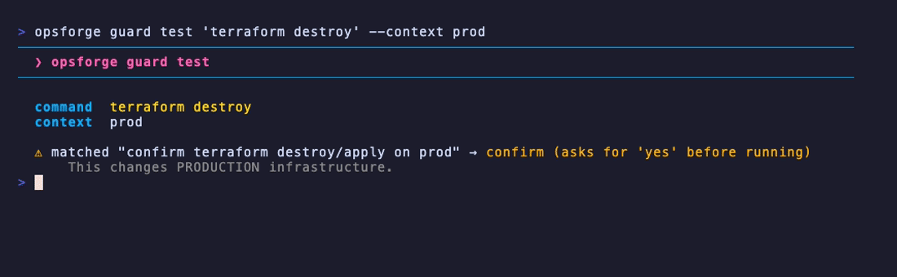
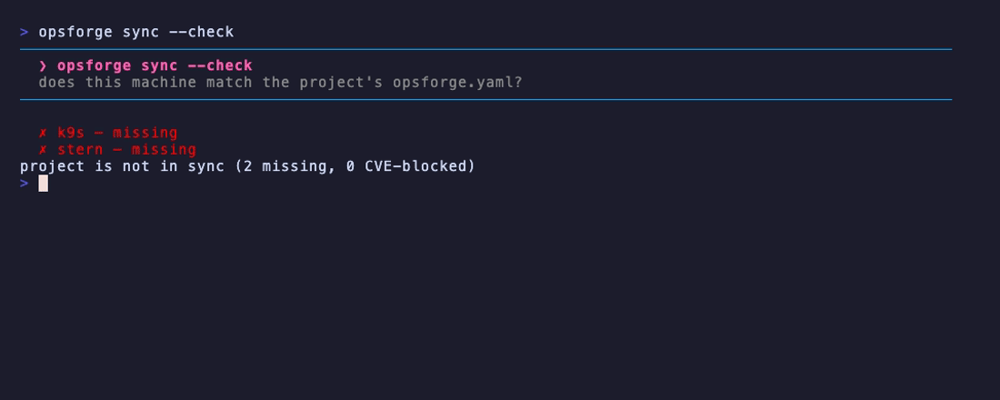
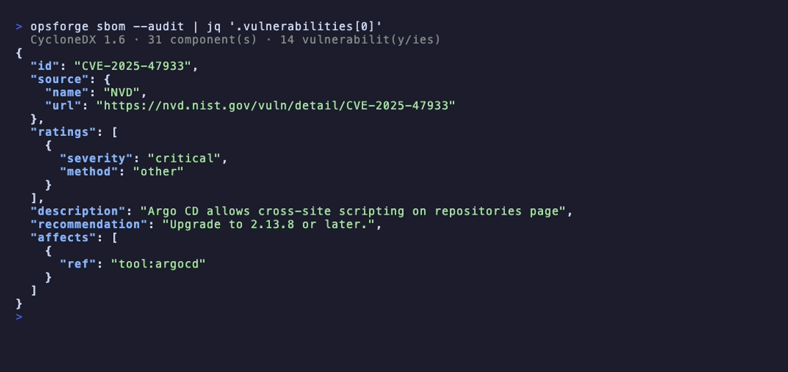

<div align="center">

# opsforge 🔥

**Your DevOps workstation, forged in minutes.**

Pick your CLIs from an interactive terminal UI, install them in one go, and turn
your zsh into a context-aware DevOps environment — live completion, a prod-aware
prompt, and **policy-as-code guards** that stop you from nuking the wrong cluster.

opsforge is the **supply-chain + policy layer for your own workstation**: it
installs your toolbox, guards how *you* use it, and hands you a CVE-correlated
SBOM plus an **OpenVEX** document of the whole thing — prioritized by CISA's
Known-Exploited catalog. It's a personal power tool, not a team platform — no
server, no account, no lock-in.

**English** · [Français](README.fr.md)

[](https://github.com/Mrg77/opsforge/actions/workflows/ci.yml)
[](https://github.com/Mrg77/opsforge/releases/latest)
[](https://goreportcard.com/report/github.com/Mrg77/opsforge)
[](LICENSE)
<br>
[](#the-catalog)
[](#sbom--supply-chain)
[](https://go.dev)


**[Try it](#try-it-in-a-sandbox) · [Install](#install) · [Tour](#a-quick-tour) · [Workflows](#common-workflows) · [Shell](#the-devops-shell-environment) · [Guards](#policy-as-code-guards) · [Project mode](#project-mode) · [SBOM & VEX](#sbom--supply-chain) · [AI agents (MCP)](#ai-agents-mcp) · [CI](#ci--integrations) · [Catalog](#the-catalog) · [Under the hood](#engineering-highlights)**

</div>

---

## What it is

opsforge is **three tools in one binary**:

| | | |
|:--:|---|---|
| 📦 | **Tool installer** | An interactive picker over **287 curated CLIs across every IT discipline** — including a new **AI & LLM** category. Detects what you have and what's outdated, then installs the rest via Homebrew *or* direct GitHub-release binaries — works on a bare Linux box with no package manager. |
| 🐚 | **DevOps shell** | One command turns your own zsh into a Warp/Fish-like experience: live completion, inline `?` help, a prod-aware prompt, and [**policy-as-code guards**](#policy-as-code-guards) on destructive commands. No shell replacement, no lock-in. |
| 📸 | **Workstation- & project-as-code** | `opsforge snapshot` exports your whole setup — tools, profiles, shell, theme *and* guard policy — to one YAML; a committed [`opsforge.yaml`](#project-mode) declares a repo's toolchain and `opsforge sync` reproduces it (with a CVE gate). `apply --check` / `sync --check` verify a machine in CI, and [`opsforge sbom`](#sbom--supply-chain) emits a CVE-correlated SBOM of it. |

### Why this exists

Three recurring frictions on a DevOps machine, each usually solved by a
different tool — or by hand:

- **Rebuilding a workstation** means installing 20+ CLIs, then wiring
  completions, aliases and a useful prompt for each, on every machine.
- **A distracted `kubectl delete` on the wrong context** has no seatbelt: the
  tools happily run it whether you're on staging or prod.
- **Nobody knows what's actually on the box** — which versions, which CVEs,
  which of them are being exploited.

opsforge folds those into one binary because they share the same data (the
detected toolbox) and the same home (your shell). It's deliberately a
**personal power tool, not a team platform** — no server, no account, no
lock-in — so it stays something you run, not something you operate.

---

## Try it in a sandbox

Want to see the guards fire without installing anything or touching real infra?
Run the throwaway demo image — a forged zsh shell already sitting in a **fake
prod context**, with no-op `kubectl`/`terraform`/`helm` stubs:

```sh
docker run --rm -it ghcr.io/mrg77/opsforge-demo
```

It opens a short guided tour (status → guards → SBOM), then drops you into the
shell so you can type `kubectl delete namespace payments` yourself and watch the
prod guard intercept it. Nothing there can reach a real cluster — the "prod"
context is a one-line fake kubeconfig, read passively, and the tools are stubs.

Prefer the browser? Open it in a Codespace — same image, zero local install:

[](https://codespaces.new/Mrg77/opsforge?quickstart=1)

---

## Install

```sh
curl -fsSL https://raw.githubusercontent.com/Mrg77/opsforge/main/install.sh | sh
```

Downloads the right binary for your OS/arch into `~/.local/bin` (override with
`OPSFORGE_INSTALL_DIR`, pin with `OPSFORGE_VERSION=v1.2.3`). From source:
`go install github.com/Mrg77/opsforge@latest`.

Keep it current with `opsforge self update` — it downloads the latest release,
**verifies its published SHA-256 before swapping the binary in place**, and
no-ops when you're already up to date (`--check` for cron/CI).

> **Windows:** use WSL — the installer backend is Homebrew and the shell layer
> targets zsh. Native winget/scoop + PowerShell support is on the roadmap.

---

## A quick tour

```sh
opsforge              # interactive picker (tabs: 1 Tools · 2 Updates · 3 Security)
opsforge status       # one-glance cockpit of your workstation
opsforge doctor       # full health check — incl. CVEs & leaked secrets
opsforge audit        # scan installed tools for CVEs (--secrets: leaked creds too)
opsforge guard test "terraform destroy" --context prod   # simulate a guard rule
opsforge apply --check my-setup.yaml                     # verify this machine matches your snapshot (CI)
opsforge self update  # self-update, checksum-verified before the swap
```

<table>
<tr><th align="left">Command</th><th align="left">What it does</th></tr>
<tr><td><code>opsforge</code></td><td>Interactive picker — browse, check, install</td></tr>
<tr><td><code>opsforge status</code></td><td>Cockpit: tools, updates, shell, theme at a glance</td></tr>
<tr><td><code>opsforge notify [--json]</code></td><td>One digest of what needs attention — CVEs, updates, leaked secrets, a newer opsforge (see <a href="#the-notify-digest">notify</a>)</td></tr>
<tr><td><code>opsforge install kubectl helm</code></td><td>Non-interactive install by name (scriptable)</td></tr>
<tr><td><code>opsforge install --profile aws-k8s</code></td><td>Install a whole stack preset in one command</td></tr>
<tr><td><code>opsforge upgrade [-u] [tool…]</code></td><td>Upgrade all, only outdated (<code>-u</code>), or named tools</td></tr>
<tr><td><code>opsforge audit [--secrets] [--json]</code></td><td>CVE scan of installed tools · optional leaked-secrets scan · <code>--json</code> + non-zero exit gates CI</td></tr>
<tr><td><code>opsforge guard [init|list|test|lint]</code></td><td>Policy-as-code guards on destructive commands · <code>lint</code>/<code>test --json</code> make them CI-checkable (see <a href="#policy-as-code-guards">Guards</a>)</td></tr>
<tr><td><code>opsforge use terraform@1.5</code></td><td>Pin a tool version here (delegates to mise/asdf)</td></tr>
<tr><td><code>opsforge sync [--check] [--init]</code></td><td>Install the tools a committed <code>opsforge.yaml</code> declares · <code>--check</code> reports drift for CI · optional CVE gate (see <a href="#project-mode">Project mode</a>)</td></tr>
<tr><td><code>opsforge sbom [--audit] [--sign]</code></td><td>Emit a CycloneDX 1.6 SBOM of installed tools · <code>--audit</code> embeds their CVEs · <code>--sign</code> adds a Sigstore bundle (see <a href="#sbom--supply-chain">SBOM</a>)</td></tr>
<tr><td><code>opsforge vex [--kev] [--sign]</code></td><td>Emit an OpenVEX document of the CVEs on your tools · <code>--kev</code> flags the actively-exploited (CISA KEV) ones · <code>--sign</code> signs it (see <a href="#vex--cisa-kev">VEX</a>)</td></tr>
<tr><td><code>opsforge mcp</code></td><td>Run a read-only MCP server so an AI agent can query your workstation (see <a href="#ai-agents-mcp">MCP</a>)</td></tr>
<tr><td><code>opsforge snapshot</code> / <code>apply</code></td><td>Export / rebuild a whole workstation</td></tr>
<tr><td><code>opsforge apply --check &lt;file-or-url&gt;</code></td><td>Verify a machine against your snapshot without changing it · non-zero exit on drift (<code>--json</code>)</td></tr>
<tr><td><code>opsforge self [version|update]</code></td><td>Report the version or self-update — checksum-verified before the swap (<code>--check</code> for CI/cron)</td></tr>
<tr><td><code>opsforge history [family|tool]</code></td><td>Recent shell commands, grouped by tool family (<code>kube</code>, <code>git</code>, <code>tf</code>… — see <a href="#history">History</a>)</td></tr>
<tr><td><code>opsforge explain [--last] &lt;cmd&gt;</code></td><td>Ask your AI CLI to explain a command or your last failure (the shell <code>??</code> shortcut)</td></tr>
<tr><td><code>opsforge list [all] [-u]</code></td><td>Installed tools · full catalog · only updates (<code>--json</code> to script)</td></tr>
<tr><td><code>opsforge list &lt;term&gt;</code></td><td>Search the whole catalog by name, description or category (e.g. <code>list dns</code>)</td></tr>
<tr><td><code>opsforge profiles</code></td><td>Stack profiles with install status</td></tr>
<tr><td><code>opsforge theme [set &lt;name&gt;]</code></td><td>List/preview/persist color themes</td></tr>
<tr><td><code>opsforge doctor</code></td><td>Full health check — system, shell, toolbox, <strong>CVEs &amp; leaked secrets</strong> (<code>--json</code>)</td></tr>
</table>

> **Machine-readable everywhere.** A global `--json` flag makes `list`, `status`,
> `doctor` and `audit` emit structured JSON instead of the TUI — see
> [CI & integrations](#ci--integrations).

### The picker

Launch the bare binary to browse by category and install what you check.

- **Tabs (k9s-style):** `1` Tools · `2` Updates (only outdated) · `3` Security
  (live CVE scan of installed tools)
- **Keys:** `space` toggle · `u` all updates · `a` all not-installed · `s` save
  selection as a profile · `/` filter · `i` install · `q` quit
- **Markers:** `[✓]` green installed · `[✓]` orange update available · `[▸]` cyan
  selected · `[ ]` grey not installed

---

## Common workflows

Three paths that show how the pieces fit together.

### Set up a new machine

Switching laptops? Rebuild your full workstation from one file instead of a day
of manual setup.

```sh
opsforge snapshot -o my-setup.yaml         # on your current machine: tools + shell + theme + guards → one YAML
opsforge apply https://…/my-setup.yaml     # on the new one: review the plan, then rebuild everything
opsforge shell install && exec zsh         # light up the DevOps shell
```

### Gate your CI on CVEs & secrets

Turn the same binary you use interactively into a one-line security gate.

```sh
opsforge audit --json | tee cve-report.json   # non-zero exit on any HIGH/CRITICAL CVE — fails the job on its own
opsforge audit --secrets --json               # also fails on a leaked credential
```

Drop-in workflow: [`examples/ci-security-gate.yml`](examples/ci-security-gate.yml).

### Version & validate your prod-guard policy

Version your own prod-safety rules in one file and keep them honest in the
pipeline — the same way you'd version the rest of your dotfiles.

```sh
opsforge guard init                                            # write a starter guards.yaml, then commit it
opsforge guard lint                                            # validate it — non-zero exit on a bad rule
opsforge guard test "terraform destroy" --context prod --json  # assert in CI that prod destroys are denied
```

---

## Beyond the basics

### Stack profiles

Install a whole stack in one command — or save your own:

```sh
opsforge install --profile aws-k8s   # aws, eksctl, kubectl, helm, k9s, terraform…
opsforge profiles                    # list all with install status
```

Built-in: `core`, `k8s`, `aws-k8s`, `gcp-k8s`, `iac`, `observability`,
`security`, `sysadmin`, `netsec`, `secrets`, `ai`. In the picker, select your tools and press `s` to save a personal
profile to `~/.config/opsforge/profiles.yaml` — then
`opsforge install --profile my-stack` reproduces it anywhere.

### Workstation as code

Your machine setup shouldn't be a snowflake you rebuild by hand:

```sh
opsforge snapshot -o my-setup.yaml    # tools + profiles + shell + theme + guards + version manager → one file
opsforge apply <file-or-url>          # rebuild it on any machine
opsforge apply --check <file-or-url>  # verify a machine against it, without changing a thing
```

A snapshot captures the **whole** managed workstation — installed tools, your
custom profiles, the shell-environment state, the active **theme**, your **guard
policy** (the raw `guards.yaml`), and the detected **version manager**. `apply`
shows the full plan and asks before changing anything (`--yes` for scripts),
restoring the theme and guard rules alongside the tools.

**Check a machine against a known-good snapshot.** `apply --check` compares this
machine to a snapshot **you froze earlier**, **without modifying anything**,
exiting **non-zero on drift** — a missing tool, or a
theme/guards/shell/version-manager that differs. With `--json` it emits a
structured report — `{compliant, missing_tools, drift}` — so a CI job can assert
that your laptop, or a build image, still matches your reference setup:

```sh
opsforge apply --check my-setup.yaml            # fails the job on any drift
opsforge apply --check my-setup.yaml --json | jq '.compliant'
```

Snapshots are **forward-compatible**: the format grew from v1 (tools, profiles,
shell) to v2 (adds theme, guards, version manager), and older v1 files still
load — the new fields simply stay unset.

### Security audit

```sh
opsforge audit             # CVEs in your installed tools
opsforge audit --secrets   # + credentials leaking in history / rc / .env
```

Cross-references installed versions against [OSV.dev](https://osv.dev), sorted by
severity, with the fix version:

```
⚠ argocd         2.11.0
    [CRITICAL] CVE-2025-47933 Argo CD allows cross-site scripting…  → fixed in 2.13.8
    [HIGH]     CVE-2025-59531 Unauthenticated argocd-server panic…  → fixed in 2.14.20
✓ helm           4.2.3 — no known vulnerabilities
```

Matching is client-side against OSV's affected ranges, so a CVE fixed before your
version (or only in a future major) isn't reported. `--secrets` scans shell
history, rc files and local `.env`s for AWS/GitHub/GitLab/Slack tokens, private
keys, `--from-literal`, `docker login -p`… with values always masked.

### Pinning tool versions

```sh
opsforge install mise
opsforge use terraform@1.5   # pins it in this directory
```

Delegates to **mise** (preferred) or **asdf** — no version-manager reinvention.

---

## The DevOps shell environment

```sh
opsforge shell install && exec zsh
```

Turns your **own zsh** into a DevOps-aware environment (modules under
`~/.config/opsforge/shell/`, `shell uninstall` restores everything):

- **Calm, on-demand editing** — nothing pops open as you type: just a grey inline
  suggestion from your history. `↑`/`↓` search history by the **whole-line
  prefix** you've typed, `→` accepts the whole suggestion, `Tab` accepts it one
  word at a time, and the line is syntax-colored as you go. Even terraform (which
  ships no zsh completion) and opsforge itself are covered.

  <table>
  <tr><th align="left">Key</th><th align="left">What it does</th></tr>
  <tr><td><code>↑</code> / <code>↓</code></td><td>Walk history by the line prefix you've typed (<code>kubectl get pods -n s</code> + <code>↑</code> cycles only lines starting that way)</td></tr>
  <tr><td><code>→</code></td><td>Accept the whole grey suggestion</td></tr>
  <tr><td><code>Tab</code></td><td>Accept the grey suggestion one word at a time (<code>ansible-play</code> + <code>Tab</code> → <code>ansible-playbook </code>)</td></tr>
  <tr><td><code>Ctrl-Space</code></td><td>File / command completion</td></tr>
  <tr><td><code>Ctrl-R</code></td><td>Search your whole history</td></tr>
  </table>

  Prefer the old always-open live menu (zsh-autocomplete)? Set
  `OPSFORGE_AUTOMENU=1`. Disable the whole layer with `OPSFORGE_INTERACTIVE=0`.
- **`?` help** — press `?` on an empty line for a themed cheat-sheet; type
  `kubectl get ?` for that command's help, rendered under a framed header with
  `bat`-colored man syntax; type `??` to have an AI explain your last failure.
- **Context prompt** — the right prompt shows the kube `cluster:namespace` and
  turns **red the moment the context looks like prod** — a passive *visual* alarm
  you see **before you even start typing**, alongside the cloud account and
  terraform workspace (each shown only when relevant). Plus a clean left prompt:
  repo-relative dir, git branch with dirty/ahead/behind markers, last-command
  duration, and a `❯` that reddens on failure. Everything is read locally — never
  a cloud or cluster contacted.
- **Policy-as-code guards** — before a destructive command (`kubectl delete`,
  `terraform destroy`, `helm uninstall`…) on a production context, opsforge can
  confirm, warn, or block — driven by [declarative rules](#policy-as-code-guards),
  not hard-coded checks. `OPSFORGE_GUARDS=0` to disable.
- **Aliases & helpers** — `k`, `tf`, `dc`, plus `kx`/`kn` to switch kube
  context/namespace (fzf picker when available). The `history` builtin is widened
  to show the last **200** lines (`history 1` for everything), and `hg <term>`
  greps your whole history — while [`opsforge history`](#history) groups it by
  DevOps tool family.
- **Proactive heads-up** — once per session, opsforge prints a compact one-liner
  in your own shell when something on your machine needs attention: a CVE just
  hit an installed tool, updates are waiting, a secret is leaking, or a newer
  opsforge is out. It reads a local cache (`~/.cache/opsforge/`, 6h TTL) and
  refreshes a stale one in the background, so the prompt never blocks on the
  network. Run [`opsforge notify`](#the-notify-digest) for the full breakdown;
  silence the heads-up with `OPSFORGE_NOTIFY=0`.
- **Integrations** — `fzf`, `zoxide`, `atuin` wired up when present.

**Three layers, three jobs:** the **prompt** is a *passive* alarm — it reddens so
you **see** you're on prod; the [**guards**](#policy-as-code-guards) are an
*active* barrier — they **stop** a destructive command; the
[**notify** heads-up](#the-notify-digest) is *proactive* watch — it **tells** you
when a CVE, update or leak lands on your machine.

Every module is validated with `zsh -n` in CI, so a broken script can never
reach your shell.

<table>
<tr><th align="left">Shell command</th><th align="left">What it does</th></tr>
<tr><td><code>opsforge shell install</code></td><td>Install the zsh environment into <code>~/.zshrc</code> (idempotent)</td></tr>
<tr><td><code>opsforge shell uninstall</code></td><td>Remove it cleanly (restores <code>~/.zshrc</code>)</td></tr>
<tr><td><code>opsforge shell doctor</code></td><td>Show what's provided and its state</td></tr>
<tr><td><code>opsforge shell sync</code></td><td>Refresh the shell modules <em>and</em> cached completions (run after upgrading opsforge)</td></tr>
</table>

### History

Your shell history is full of the exact commands you need again — buried under
everything else. `opsforge history` pulls out just one family of DevOps tools, so
you can find last week's `kubectl port-forward` without scrolling.

```sh
opsforge history              # overview: every family, with how many recent commands each has
opsforge history kube         # recent kubectl / helm / k9s / argocd… commands
opsforge history tf           # terraform / tofu / terragrunt
opsforge history git -n 50    # more results (0 = no cap)
opsforge history kube --json  # machine-readable
```

Built-in families group the tools you think of together — and deliberately mirror
the domains used by [guards](#policy-as-code-guards) and profiles, so `kube`,
`tf`, `cloud`… mean the same thing across the product:

<table>
<tr><th align="left">Family</th><th align="left">Tools</th></tr>
<tr><td><code>kube</code></td><td>kubectl, helm, k9s, kubectx, kustomize, stern, kubeseal, flux, argocd…</td></tr>
<tr><td><code>git</code></td><td>git, gh, glab, lazygit, tig</td></tr>
<tr><td><code>tf</code></td><td>terraform, tofu, terragrunt, tflint, terraform-docs</td></tr>
<tr><td><code>docker</code></td><td>docker, docker-compose, podman, nerdctl, colima</td></tr>
<tr><td><code>cloud</code></td><td>aws, gcloud, az, doctl, eksctl, flyctl, vercel</td></tr>
<tr><td><code>ansible</code></td><td>ansible, ansible-playbook, ansible-galaxy, ansible-vault</td></tr>
</table>

Pass a family name, or any executable to filter by that single tool. Results are
distinct commands, most-recent first, with a `×N` run count; `--limit/-n` caps
them (default 20, `0` = all) and `--json` emits them for scripts. History is
parsed **passively** — opsforge reads the file, never executes anything.

---

## Policy-as-code guards

<div align="center">



</div>

Tools like Homebrew Bundle, mise, chezmoi and aqua install your CLIs; opsforge
adds a layer on top of that — it **guards how you use them**. It turns the
prod-safety layer of the shell into a small policy engine: a declarative set of
rules that decides whether a destructive command should run, warn, confirm, or be
refused — based on the context you're actually in.

### The one rule to understand

A guard fires only when **two things line up at once**: a **destructive command**
*and* a **production marker**. Miss either one and the command runs untouched —
so read-only commands never nag you, and destructive commands on staging or dev
stay out of your way. It's a safety net for the distracted gesture, not a wall in
front of every command.

| Command | Context | Decision | Why |
|:--|:--|:--:|:--|
| `kubectl delete pod api` | `prod-eks` | ⚠️ confirm | destructive + prod |
| `kubectl get pods` | `prod-eks` | ✓ allow | prod, but read-only |
| `kubectl delete pod api` | `staging` | ✓ allow | destructive, but not prod |
| `terraform destroy -var-file=prod.tfvars` | *(none)* | ⚠️ confirm | prod is in the command itself |
| `terraform destroy -var-file=dev.tfvars` | *(none)* | ✓ allow | dev, not prod |
| `terraform plan -var-file=prod.tfvars` | *(none)* | ✓ allow | plan is read-only |
| `helm uninstall app` | `prod` | ⚠️ confirm | destructive + prod |
| `ls` · `git status` · `cat` | `prod` | ✓ allow | nothing destructive |

Simulate any of these yourself with `opsforge guard test "<cmd>" --context <ctx>`.

The built-in policy reaches past Kubernetes and Terraform: it also catches a
**`git push --force` / `reset --hard` on `main`**, destructive **cloud** calls
(`aws s3 rm --recursive`, `ec2 terminate`, `eks/rds/cloudformation delete`,
`gcloud`/`az … delete` on prod), **container** footguns (`docker system prune`,
`volume rm`, `rm -f`) and **database** wipes (`FLUSHALL`, `DROP DATABASE` on
prod) — the everyday commands worth a second look, not just the obvious ones.

Rules live in a single file, `~/.config/opsforge/guards.yaml`. Each rule matches a
**command** regex and a **context** regex, and picks an action:

| Action | Effect |
|:--|:--|
| `allow` | run normally (also the result when nothing matches) |
| `warn` | print the message, then run |
| `confirm` | require typing `yes` before running |
| `deny` | block the command outright |

```yaml
# ~/.config/opsforge/guards.yaml  (first match wins)
version: 1
rules:
  - name: "confirm destructive kubectl on prod"
    match:
      command: "kubectl (delete|drain|cordon|apply|replace)"
      context: "prod|production"
    action: confirm
    message: "This changes PRODUCTION Kubernetes resources."

  - name: "never delete namespaces on prod"
    match:
      command: "kubectl delete (ns|namespace)"
      context: "prod"
    action: deny
    message: "Deleting a prod namespace is forbidden by policy."
```

```sh
opsforge guard init                                    # write a commented starter guards.yaml
opsforge guard list                                    # show the active rules (built-in or yours)
opsforge guard test "terraform destroy" --context prod # simulate: which rule fires, and the action
opsforge guard lint                                    # validate guards.yaml — non-zero exit on error
opsforge guard test "kubectl delete ns" --context prod --json  # {command, context, matched_rule, action, message}
```

**Policy you can version and validate in CI.** Because the rules live in one file,
you can commit `guards.yaml` alongside your dotfiles and keep it honest in the
pipeline:

- `opsforge guard lint` validates the active policy and **exits non-zero** when
  it's broken — a bad regex, unknown action, or wrong version fails the job
  instead of silently falling back to the default policy at runtime.
- `opsforge guard test "<cmd>" --context prod --json` emits the decision as
  `{command, context, matched_rule, action, message}`, so a pipeline can
  **assert** that, say, `terraform destroy` is `deny`ed on prod — the same
  `Evaluate` call the shell uses, so the test can't diverge from real behavior.

The guards apply on your own shell, and the policy that drives them is
**testable and versionable** like the rest of your setup — not a per-machine
snowflake you tweak by hand.

### How opsforge knows you're on prod

The "context" a rule matches against comes from **two places**, and opsforge is
deliberately honest about the trade-offs of each:

- **Read passively from your environment** — never running a single command.
  opsforge scrapes the kubeconfig `current-context`, `AWS_PROFILE`/`AWS_VAULT`
  (or `CLOUDSDK_ACTIVE_CONFIG_NAME`), and the terraform workspace
  (`.terraform/environment`). It **never runs `kubectl` or `gcloud`** to figure
  out where you are, so evaluating a rule can't trigger an OIDC browser login or
  hang on a wrapper CLI.
- **Read from the command itself** — because in 2026 teams target prod far more
  often with `-var-file=prod.tfvars` or an `environments/prod/` directory than
  with a terraform *workspace*. The default policy therefore also matches those
  markers **in the command line** for `terraform`/`tofu`/`terragrunt`, so
  `terraform destroy -var-file=prod.tfvars` confirms even with no workspace set.
  `terraform plan …` stays allowed — it's read-only.

> **Be clear-eyed about what this is.** Guards are a **safety net against the
> distracted gesture** — they catch you when you switch env without noticing,
> not a determined mistake. They are **not** a security boundary. Real prod
> protection stays where it belongs: `prevent_destroy`, separate cloud accounts,
> and CI approvals. opsforge **complements** that layer, it doesn't replace it.

### What you see when a guard fires

On a `confirm`, the command is held at the prompt until you type `yes`:

```text
⚠  opsforge guard
   This changes PRODUCTION Kubernetes resources.
   kubectl delete pod api -n payments
   (to skip guards this session: OPSFORGE_GUARDS=0)
Type 'yes' to run this: ▏
```

A `deny` prints a red **✗ Blocked by opsforge guard** and clears the line; a
`warn` prints its message and runs anyway.

### Everything is configurable in one file

- **Zero-config by default.** With no `guards.yaml`, the built-in policy above
  reproduces the old prod-confirm behavior exactly — upgrading changes nothing
  until you opt into custom rules. Start customizing with `opsforge guard init`,
  which drops a fully commented `guards.yaml` you can edit.
- **Fast on the hot path.** The shell pre-filters cheaply and only calls the
  engine (`opsforge guard check`, used internally) on commands that look
  destructive, so your prompt stays instant.
- **Fails open, loudly.** A broken `guards.yaml` can never wedge your shell: the
  command runs, and the parse error is printed to stderr so you can fix your YAML.

Disable everything for one session with `OPSFORGE_GUARDS=0`.

---

## Project mode

<div align="center">



</div>

A workstation snapshot pins a whole *machine*. A **project** often needs less —
just the toolchain *this repo* depends on. Commit an `opsforge.yaml` at its root
and anyone reproduces it with one command — the same reproducibility mise and
devbox give you, with a CVE gate added on top.

```yaml
# opsforge.yaml — commit at the repo root
version: 1
tools:
  - kubectl
  - helm
  - terraform
profiles:
  - core          # pull in whole stack profiles too
fail_on: high     # optional: sync fails if a required tool has a HIGH/CRITICAL CVE
```

```sh
opsforge sync           # install whatever the manifest declares that's missing
opsforge sync --check   # report drift, exit non-zero if a required tool is missing (CI/pre-commit)
opsforge sync --init    # write a starter opsforge.yaml here
```

`sync` walks up from the working directory to the nearest `opsforge.yaml`, so it
works from any subdirectory. It resolves `tools` + `profiles` into one
de-duplicated list, installs only what's missing (via Homebrew or a GitHub
release, per tool), and skips anything not in the catalog with a warning.

**A CVE gate in the same file.** Set `fail_on: high` (or
`critical`) and `sync` audits *just the tools this project requires* against
[OSV.dev](https://osv.dev) and **fails** when one carries a CVE at that level —
so a single committed file gives you both a **reproducible environment** *and* a
**supply-chain gate** in one place. With `--json`, `sync
--check` emits `{compliant, missing, present, unknown, cve_blocked, fail_on}` for
a pipeline to assert on:

```sh
opsforge sync --check --json | jq '.compliant'   # fails the job on drift or a blocked CVE
```

**A lockfile for verifiable reproducibility.** `opsforge sync` also writes an
**`opsforge.lock`** next to the manifest, pinning each installed tool to its
exact resolved version — the same idea as `package-lock.json` or `mise.lock`.
Commit it, and `sync --check` no longer just verifies a tool is *present* — it
verifies it's the *pinned version*, flagging **version drift** in both the human
and JSON output:

```yaml
# opsforge.lock — written by sync, checked by sync --check (commit it)
version: 1
tools:
  - name: helm
    version: 3.14.0
  - name: kubectl
    version: 1.29.3
```

```sh
opsforge sync --check --json | jq '.version_drift'
# [{"name":"helm","expected":"3.14.0","got":"3.15.1"}]  → non-zero exit
```

It's non-breaking: with no lockfile, `--check` behaves exactly as before; a tool
pinned with an unknown version is never flagged. That's what turns
"workstation-as-code" from a wish into reproducibility a reviewer can trust —
`opsforge.yaml` declares *what*, `opsforge.lock` proves *which exact version*.

---

## SBOM & supply-chain

<div align="center">



</div>

opsforge emits a **CVE-correlated SBOM of your workstation** — a supply-chain
artifact consumable by grype, `trivy sbom`, or a compliance pipeline.

```sh
opsforge sbom                # CycloneDX 1.6 JSON of your installed tools → stdout
opsforge sbom --audit > bom.json   # + embedded CVE findings, captured to a file
```

- **`opsforge sbom`** builds a **CycloneDX 1.6** document where each installed
  tool is a component with its detected **version** and — when the catalog maps
  it to a package ecosystem — a **PURL**.
- **`opsforge sbom --audit`** cross-references OSV.dev and embeds the known CVEs
  as CycloneDX **vulnerabilities**, each linked to its component with a severity
  and the recommended fix version. The SBOM ships CVE-corrected out of the box.

The document goes to stdout (a short summary to stderr), so
`opsforge sbom > bom.json` gives you a clean file plus feedback — a signed
inventory of your toolbox *with* its vulnerabilities, ready to feed a scanner or
a compliance gate.

That's the full supply-chain chain in one binary: a **checksum** proves each
download is intact, a **cosign signature** proves the release is authentic (see
[the catalog](#the-catalog)), and the **SBOM** proves what you ended up with —
CVEs included.

### VEX & CISA KEV

A raw CVE list tells you a vulnerability *exists*. It doesn't tell you which of
the dozens to fix **first** — and since the NVD stopped enriching most CVEs in
2026, the CVSS score you'd sort by is often missing or stale. `opsforge vex`
answers both questions.

```sh
opsforge vex                 # OpenVEX document → stdout (pairs with `opsforge sbom`)
opsforge vex --kev           # + highlight the actively-exploited (CISA KEV) CVEs
opsforge vex > vex.json      # capture the machine artifact
```

- **`opsforge vex`** turns the audit into an **[OpenVEX](https://openvex.dev)
  v0.2.0** document: one machine-readable statement per (component, CVE) with a
  status (`affected`) and an **action** — upgrade to the fixed version, or
  monitor the advisory when none exists yet. Each component is identified by the
  **same PURL the SBOM uses**, so a downstream scanner or auditor correlates the
  two out of the box. Output is deterministically sorted, so it diffs and signs
  cleanly.
- **`opsforge vex --kev`** cross-references **CISA's Known Exploited
  Vulnerabilities** catalog and calls out the CVEs being **exploited in the
  wild** — the handful to fix *now*, ahead of the long tail. The catalog is
  fetched once and cached (`~/.cache/opsforge/kev.json`, 24h TTL); it's
  best-effort, so a network hiccup degrades to "no KEV data", never a failed
  command.

Prioritizing by **exploitability** instead of by a score that may not exist is a
sensible way to triage in 2026 — and VEX is the artifact that carries that
verdict to whatever consumes it next.

### Signing the artifacts

Both the SBOM and the VEX document can be signed into a self-contained
**[Sigstore](https://www.sigstore.dev) bundle** you can hand to anyone:

```sh
opsforge sbom --sign > bom.json      # + a bom.sigstore.json bundle
opsforge vex  --sign > vex.json      # + a vex.sigstore.json bundle
cosign verify-blob --key ~/.config/opsforge/signing.pub \
  --bundle bom.sigstore.json bom.json
```

`--sign` signs the document **key-based** with a persistent local opsforge key
(an ECDSA P-256 key generated on first use under `~/.config/opsforge/`) and
writes a Sigstore bundle that `cosign verify-blob` — or any Sigstore verifier —
accepts. It's fully **offline**: no OIDC login, no certificate, no entry in a
public transparency log.

That last part is deliberate, and worth being precise about:

- **Local signing is key-based, on purpose.** Keyless Sigstore signing would
  publish the signer's OIDC identity (your email) in Rekor — a public, immutable
  log — on *every* signature, and it would prove nothing about supply-chain
  *provenance* for a document generated by hand on a laptop. So opsforge signs
  with a local key instead.
- **Be clear about what it proves.** A key-based signature proves the
  document's **integrity** and **attribution to your key** — not that it was
  built by a trusted pipeline. Provenance is a CI property: opsforge's own
  *releases* are the ones signed **keyless with SLSA provenance** (see
  [the catalog](#the-catalog)), because there the identity *is* the pipeline.

Same primitives, right tool for each job — local integrity for the artifacts you
generate, keyless provenance for the binaries you ship.

### The notify digest

opsforge doesn't wait for you to run `audit` — `opsforge notify` is **one
digest of everything on *your* machine that needs attention**, in a single
place:

- installed tools carrying a **known CVE** (HIGH/CRITICAL called out in red),
- tools that **can be updated**,
- **credentials leaking** in your shell history / rc / `.env` (when scanned),
- a **newer opsforge** than the one you're running.

Each line comes with the exact command that fixes it:

```
  ✗ 1 tool with a HIGH/CRITICAL CVE          → opsforge audit
  ✗ 6 critical secrets leaking in your shell → opsforge audit --secrets
  ⚠ 3 tools can be updated                   → opsforge upgrade -u
```

```sh
opsforge notify            # the full digest, grouped by severity
opsforge notify --json     # the structured Digest, for scripts
opsforge notify --refresh  # recompute the cache now
opsforge notify --quiet    # just the compact one-liner (used by the shell)
```

**A heads-up in your shell, once per session.** When something needs your
attention, the [DevOps shell](#the-devops-shell-environment) prints a compact
one-liner on startup — e.g. *"opsforge: 1 tool with a HIGH/CRITICAL CVE · 3
tools can be updated — run `opsforge notify`"* — then you run `opsforge notify`
for the breakdown. Silence it with `OPSFORGE_NOTIFY=0`.

**Cached, instant, never blocking.** `notify` reads a local cache under
`~/.cache/opsforge/` (6h TTL) and only ever *reads* it — a stale cache is
refreshed in the background (or on demand with `--refresh`), so neither the
digest nor the shell heads-up ever waits on the network. The same finding also
surfaces at a glance in [`opsforge status`](#a-quick-tour).

It folds CVEs, updates, leaked secrets *and* its own self-update into one digest
and surfaces it, proactively, in your shell — so the moment an advisory lands on
your toolbox, you know, without running a thing.

---

## AI agents (MCP)

opsforge speaks the **[Model Context Protocol](https://modelcontextprotocol.io)**
— so an AI agent (Claude Code, Cursor, any MCP client) can *ask about your
workstation* through the same data the CLI computes, with no scraping and no
guessing.

```sh
claude mcp add opsforge -- opsforge mcp   # register the stdio server once
```

`opsforge mcp` runs a stdio MCP server exposing **five read-only tools**:

| Tool | What the agent gets |
|:--|:--|
| `list_installed_tools` | every installed tool, its version, category, and whether it's outdated |
| `audit_vulnerabilities` | the CVEs on those tools (top severity + fixed-in), straight from OSV.dev |
| `generate_sbom` | a CycloneDX 1.6 SBOM (optionally with embedded CVEs) |
| `workstation_status` | one-glance summary: installed/outdated counts, shell state, kube/cloud/tf context |
| `check_guard_policy` | evaluate a command against your guard policy — `allow`/`warn`/`confirm`/`deny` — *before* the agent suggests running it |

> **Read-only by design.** Every tool is derived from read-only sources —
> **nothing over MCP installs, upgrades, or changes the machine**. That's a
> deliberate boundary: an agent can *inspect* your workstation and *reason*
> about it (what's outdated, what carries a CVE, whether a command would trip a
> prod guard), but the mutating actions stay behind the interactive CLI, where
> *you* confirm them. `check_guard_policy` never runs the command, and — like
> the shell — reading the context never invokes `kubectl`/`gcloud`.

This turns opsforge into a **grounded source of truth** an agent can lean on:
instead of hallucinating your tool versions or guessing whether `terraform
destroy` is safe here, it asks.

---

## CI & integrations

opsforge isn't just a pretty TUI — a global `--json` flag makes `list`, `status`,
`doctor` and `audit` emit structured JSON, so the same binary you use interactively
also drives scripts and pipelines.

```sh
opsforge audit --json | jq '.tools[] | select(.vulnerable)'   # only the affected tools
opsforge doctor --json | jq '.status'                         # "healthy" | "warnings" | "failing"
opsforge list all --json | jq '.[] | select(.outdated).name'  # tools with an update
```

The security commands also set **meaningful exit codes**, which is what turns
opsforge into a one-line gate:

- `opsforge audit` (and `--json`) exits **non-zero on any HIGH/CRITICAL CVE**.
- `opsforge audit --secrets` adds leaked credentials to the report; a **critical
  leak** exits non-zero too.
- `opsforge doctor --json` returns `{status, passed, warnings, failed, checks[]}`
  and fails when a check fails.

Ready-to-use GitHub Actions workflow: [`examples/ci-security-gate.yml`](examples/ci-security-gate.yml)
— it installs opsforge and fails the pipeline on any HIGH/CRITICAL CVE or leaked
credential, uploading the JSON reports as artifacts.

```yaml
# excerpt — audit exits non-zero on HIGH/CRITICAL, failing the job on its own
- name: CVE audit
  run: opsforge audit --json | tee cve-report.json
```

### Official GitHub Action

Skip the install boilerplate — the composite action does it, then runs whichever
gates you switch on (`audit`, `secrets`, `guard-lint`, `sbom`, `baseline`):

```yaml
- uses: Mrg77/opsforge@v1
  with:
    audit: 'true'          # fail on any HIGH/CRITICAL CVE
    secrets: 'true'        # also fail on a leaked credential
    guard-lint: 'true'     # validate guards.yaml (policy-as-code)
    sbom: 'true'           # emit a CycloneDX SBOM, uploaded as an artifact
    vex: 'true'            # emit an OpenVEX doc (KEV-prioritized), uploaded too
    baseline: my-setup.yaml   # assert this machine matches your snapshot
```

Full example: [`examples/github-action-usage.yml`](examples/github-action-usage.yml).

### Docker image

A distroless image (~20–30 MB, no package manager) ships the static binary — run
any command against a build image that has your CLIs:

```sh
docker run --rm ghcr.io/mrg77/opsforge audit --json
```

This is the production image — minimal, non-interactive. For a *playground* with
a shell and the guards wired up, see [Try it in a sandbox](#try-it-in-a-sandbox)
(`ghcr.io/mrg77/opsforge-demo`).

### pre-commit hooks

Gate commits with the same policy engine, straight from
[`.pre-commit-hooks.yaml`](.pre-commit-hooks.yaml):

```yaml
# .pre-commit-config.yaml
repos:
  - repo: https://github.com/Mrg77/opsforge
    rev: v1.0.0
    hooks:
      - id: opsforge-guard-lint   # validate guards.yaml — fails on a bad rule
      - id: opsforge-secrets      # block a commit leaking a credential
```

---

## The catalog

**287 tools across 16 categories** — Kubernetes, Infrastructure as Code, Cloud
CLIs, Containers, Git & CI/CD, Observability & Monitoring, Logs, Networking &
HTTP, **System & SysAdmin**, Databases, Security & Compliance, Secrets & Identity,
Serverless & PaaS, Runtime & Versions, Utilities, and a new **AI & LLM** category.
The catalog now spans **every IT job** — not just Kubernetes and cloud, but
development, DevOps, systems, networking, security, databases and AI — so a dev, a
DevOps engineer, a sysadmin, a network engineer, a DevSecOps or an AI engineer all
find their toolbox here:

- **Networking** — `tcpdump`, `iperf3`, `nmap`, `wireguard`…
- **System & SysAdmin** — `htop`, `tmux`, `zellij`, `rclone`…
- **Security & pentest** — `nuclei`, `ffuf`, `semgrep`, `trivy`, `opa`…
- **Databases** — `mongosh`, `litecli`, `atlas`…
- **Observability, GitOps & pipelines** — `prometheus`, `otel-cli`, `grafana`,
  `argo`, `tekton`/`tkn`, `dagger`…
- **AI & LLM** — `ollama`, `llm`, `aichat`, `mods`, `aider`, `fabric`,
  `gemini-cli`, `promptfoo`, `codex`…

It's a single embedded [YAML file](internal/catalog/catalog.yaml) — adding a tool
is a five-line PR.

**Two install backends, picked per tool at runtime:**

- **Homebrew** (when on PATH) — always the latest release; `opsforge upgrade`
  refreshes the whole toolbox.
- **GitHub releases** — for hosts without Homebrew (bare Linux, CI images), tools
  with a `github:` block are installed by downloading their release binary into
  `~/.local/bin`. No package manager required.

Force one with `OPSFORGE_BACKEND=brew|github`; set the target dir with
`OPSFORGE_BIN_DIR`.

**Supply-chain: checksum verification.** Before a GitHub-release binary is made
executable, opsforge verifies its **SHA-256 against a published checksum** —
`checksums.txt`, `<asset>.sha256`, or a template declared per tool via the
catalog's `checksum:` field. A mismatch **refuses the install**; a release that
publishes no checksum is a warning, not a failure (best-effort, so the ~85% of
projects that ship none still install).

**Supply-chain: signed provenance.** opsforge's own releases are **signed
keyless with [cosign](https://github.com/sigstore/cosign) (Sigstore)** — no
long-lived key, the certificate is bound to the release workflow's GitHub OIDC
identity — plus a native GitHub **SLSA build-provenance attestation**. The
release publishes `checksums.txt.sig` + `checksums.txt.pem` alongside
`checksums.txt`. On **self-update**, if `cosign` is installed locally, opsforge
verifies that signature against the expected identity and prints *"signature
verified (cosign, keyless)"* — a valid checksum whose signature does **not**
verify is refused like a mismatch. Verify it yourself:

```sh
cosign verify-blob \
  --certificate checksums.txt.pem \
  --signature   checksums.txt.sig \
  --certificate-identity-regexp '^https://github.com/Mrg77/opsforge/\.github/workflows/release\.yml@.*' \
  --certificate-oidc-issuer https://token.actions.githubusercontent.com \
  checksums.txt
```

### Add your own tools

The catalog isn't a closed list. Point opsforge at an **overlay** and your own
tools — internal or private CLIs — show up in the picker, profiles and every
command, **no PR required**. Two ways to load one:

- Drop one or more files in `~/.config/opsforge/catalog.d/*.yaml` (merged in
  alphabetical order).
- Or set `OPSFORGE_CATALOG=/path/to/my-catalog.yaml`.

The format is exactly the catalog's — `categories:` with `tools:` (`name`, `bin`,
`brew`, `description`), and optional `profiles:`:

```yaml
# ~/.config/opsforge/catalog.d/internal.yaml
categories:
  - name: Internal
    tools:
      - name: acme-cli
        bin: acme
        brew: acmecorp/tap/acme-cli
        description: ACME Corp internal deploy CLI
```

Merge semantics are predictable:

- A tool with a **new name** is **added** to the catalog.
- A tool with an **existing name** **overrides** the built-in one — pin an
  internal formula, swap a source, tweak a description.
- A profile with an existing name is likewise **replaced**.
- **Unknown YAML fields are rejected**, so a typo fails loudly instead of being
  silently ignored.

This is how you fold your own internal or private CLIs into opsforge: keep an
overlay next to your dotfiles and your in-house tooling installs the same way as
the public catalog.

---

## Themes

The whole UI is themeable — one palette drives every command:

```sh
opsforge theme              # list all themes with a color preview
opsforge theme dracula      # preview one
opsforge theme set dracula  # persist it — every command follows, no reload
```

Themes: `forge` (default), `nord`, `dracula`, `gruvbox`, `light`, `mono`, `auto`.
`auto` matches your terminal background; `mono` is color-free for logs/CI. The
theme drives **every command *and* the interactive picker** — one palette, no
stray default colors anywhere. Precedence: `$OPSFORGE_THEME` › saved (`theme
set`) › auto.

---

## Engineering highlights

The parts worth pointing a reviewer to:

- **Policy engine for the shell.** Prod guards aren't hard-coded `if`s — they're a
  declarative policy (regex × context → allow/warn/confirm/deny), first-match-wins,
  validated on load, with a behavior-preserving built-in default. Context is read
  passively (kubeconfig / env / tf workspace) so evaluation never triggers an OIDC
  login, and the shell only calls the engine on commands that look destructive.
- **CVE audit with real version matching.** Queries OSV.dev per tool, filters
  vulnerabilities *client-side* against OSV's affected ranges (semver
  `introduced`/`fixed`) and dedupes CVEs listed under multiple advisory IDs — so
  it reports only what affects the version you run, with the fix on your branch.
  Severity comes from a real **CVSS v3.1 base-score computation** off the OSV
  vector, so a critical CVE is never mis-ranked or missed.
- **Supply-chain checksum verification.** GitHub-release binaries are SHA-256
  checked against a published checksum (`checksums.txt`, `<asset>.sha256`, or a
  catalog `checksum:` template) *before* they're made executable — a mismatch
  refuses the install; a release with no checksum degrades to a warning.
- **A self-update that verifies its own integrity — and provenance.**
  `opsforge self update` fetches the latest release, checks its published
  SHA-256, and only then replaces the running binary — atomically. The same
  supply-chain guarantee the installer gives your tools, opsforge applies to
  itself: a tampered asset is never made executable. Because our releases are
  **cosign-signed keyless**, self-update also **verifies that signature**
  (when cosign is installed) against the release-workflow OIDC identity — a
  published-but-invalid signature is refused like a mismatch. `--check` reports
  availability with an exit code for cron/CI, and a dev build (no release tag to
  compare) is a safe no-op.
- **Keyless-signed releases with SLSA provenance.** Releases are signed with
  **cosign keyless (Sigstore/Fulcio)** off the GitHub Actions OIDC identity —
  no key to store — and carry a native GitHub **SLSA build-provenance
  attestation**. `checksums.txt.sig` + `checksums.txt.pem` ship on every
  release; anyone can `cosign verify-blob` them against the workflow identity.
- **One source of truth for tool families.** The DevOps "families" (`kube`,
  `tf`, `cloud`…) that `history` filters by and that the guard prefilter derives
  from now live in a single package (`internal/families`) — the taxonomy that
  was once hard-coded in three diverging places. Adding a tool to a family, or a
  new danger verb, is a one-line change consumed everywhere at once.
- **Machine-readable, with exit codes that mean something.** A global `--json`
  flag renders `list`/`status`/`doctor`/`audit` as structured JSON; `audit` exits
  non-zero on HIGH/CRITICAL CVEs (and critical secret leaks with `--secrets`), so
  it drops into CI as a security gate with no wrapper script.
- **A CVE-correlated SBOM of your workstation.** `opsforge sbom` builds a
  CycloneDX 1.6 document from the *detected* tools — each a component with its
  version and, when mapped, a PURL — and `--audit` embeds the OSV.dev CVEs as
  linked CycloneDX vulnerabilities — a signed inventory of your toolbox *with*
  its vulnerabilities, feedable to grype/trivy or a compliance gate.
- **OpenVEX + exploitability triage.** `opsforge vex` re-uses the audit to emit
  an OpenVEX v0.2.0 document — one `affected` statement per (PURL, CVE) with an
  action — sharing the *exact* PURL the SBOM uses, so the two correlate. `--kev`
  cross-references CISA's Known-Exploited catalog (cached, 24h TTL, best-effort)
  to surface what's exploited *in the wild* — a sensible way to prioritize now
  that CVSS enrichment is unreliable. The builder is pure (id/timestamp
  injected) and deterministically sorted, so the document diffs and signs.
- **Key-based Sigstore signing, chosen deliberately.** `sbom --sign` / `vex
  --sign` produce a self-contained Sigstore bundle via `sigstore-go` (a light
  dep — not cosign-as-a-library, which would bloat go.mod), implementing the
  `Keypair` interface over a persistent local ECDSA P-256 key so signing is
  fully offline and the public key is stable across signatures. It's key-based,
  not keyless, on purpose: keyless would publish the signer's identity in a
  public Rekor log and prove nothing about provenance for a hand-generated
  document — so local signing proves integrity + key attribution, and keyless
  provenance stays on the CI-signed releases. Verifiable with `cosign
  verify-blob`; the bytes signed are exactly the bytes written, so verification
  matches the file.
- **A read-only MCP server.** `opsforge mcp` exposes the workstation to AI agents
  over the Model Context Protocol via five tools (installed tools, CVE audit,
  SBOM, status, guard-policy check). The payload builders are pure functions over
  data opsforge already computes, unit-tested without a live client; every tool
  is `ReadOnlyHint` and derived from read-only sources — the mutating commands
  stay behind the interactive CLI by design, so an agent can inspect but never
  change the machine.
- **A lockfile for verifiable reproducibility.** `opsforge sync` writes an
  `opsforge.lock` pinning each tool's exact resolved version (normalized,
  name-sorted for clean diffs); `sync --check` compares the machine against it
  and reports *version* drift — not just missing tools — in JSON and human
  output, non-zero on mismatch. `opsforge.yaml` declares *what*, `opsforge.lock`
  proves *which version* — and it degrades gracefully (no lock → old behavior).
- **One cached digest, never blocking.** `opsforge notify` aggregates CVEs,
  available updates, leaked secrets and a newer opsforge into a single cached
  digest (`internal/notices`, `~/.cache/opsforge/`, 6h TTL). Both the shell (a
  once-per-session one-liner via `notify.zsh`) and `opsforge status` read it
  *without* a synchronous network call — a stale cache is recomputed in a
  detached background process — so the heads-up path can never hang your prompt.
  A fresh CVE, update or leak surfaces in your shell without you asking for it.
- **Reproducible env + a CVE gate in one file.** A committed `opsforge.yaml`
  (`version`, `tools`, `profiles`, `fail_on`) makes `opsforge sync` reproduce a
  repo's toolchain — and `fail_on: high|critical` audits *only the required
  tools* and fails the sync on a matching CVE. That's the reproducibility mise
  and devbox give you, plus a supply-chain gate in the same file.
- **Auth-safe detection.** Probing `kubectl --version` where kubectl is a
  cloud-SDK dispatcher wired to an OIDC plugin can pop a browser login. Every
  probe runs with a neutralized `KUBECONFIG` and a `WaitDelay`, so detection
  never triggers auth or hangs on a wrapper CLI holding the output pipe.
- **The catalog can't lie.** A CI job validates all 287 brew references against
  the Homebrew API and every GitHub asset template against the tool's real latest
  release (darwin/linux × amd64/arm64) — a renamed formula is caught before a
  user hits it mid-install.
- **Homebrew edge cases handled.** Auto-taps third-party taps and recovers from
  link conflicts (`brew link --overwrite`) that otherwise fail a docker upgrade.
- **Never breaks your shell.** Modules are `zsh -n`-checked in CI; the `shell
  env` snippet does only PATH lookups (no subprocesses) for fast startup.

### Architecture

```
cmd/                Cobra commands (install, status, audit, guard, sync, sbom, vex, mcp, snapshot, apply, self, doctor, shell, theme…)
internal/catalog/   Embedded YAML catalog + brew/github validation + OSV ecosystem mappings
internal/project/   opsforge.yaml manifest: resolve tools/profiles, drift plan, CVE gate (sync) + opsforge.lock (lock.go)
internal/sbom/      CycloneDX 1.6 builder (components + PURLs + embedded CVE vulnerabilities)
internal/vex/       OpenVEX v0.2.0 builder + CISA KEV fetch/cache (kev.go)
internal/attest/    Key-based Sigstore signing of the SBOM/VEX (local ECDSA key → Sigstore bundle)
internal/mcp/        Read-only MCP payload builders (pure functions over catalog/detect/audit/guard)
internal/detect/    Concurrent PATH + version detection + brew-outdated
internal/installer/ Backend router: Homebrew + GitHub-releases download (checksum.go: SHA-256 verify; self-update)
internal/audit/     OSV.dev client + client-side version matching + CVSS v3.1 scoring
internal/families/  Single source of truth for DevOps tool families (consumed by history + guard prefilter)
internal/history/   Passive shell-history reader + DevOps tool-family grouping
internal/secrets/   Leaked-credential scanner
internal/notices/   Cached digest behind `opsforge notify` (CVEs + updates + secrets + self-update)
internal/output/    Machine-readable JSON emitter for the --json flag
internal/snapshot/  Workstation capture / apply / --check drift report
internal/tui/       Bubble Tea picker with tabs (theme-bound styling)
internal/shellcfg/  zsh environment modules (incl. notify.zsh) + completion cache + guard policy engine (policy.go)
internal/ui/        Shared visual identity + themes
```

---

## Development

```sh
go test ./...                                   # unit tests
OPSFORGE_SKIP_BREW_VALIDATION=1 go test ./...   # skip the network catalog checks
go build -o opsforge .
```

CI runs gofmt, vet, race tests on Linux & macOS, validates the catalog against
upstream, and cross-compiles all targets. Releases are cut by GoReleaser on tag.

## Roadmap

- [ ] bash & fish support for the shell layer (currently zsh-only)
- [ ] Native Windows (winget/scoop + PowerShell completions)
- [ ] More `github:` templates for full brew-less coverage

## License

MIT
